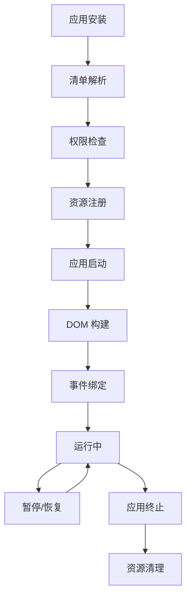
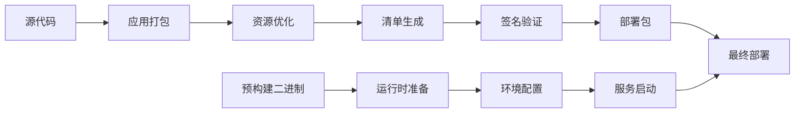

# Nutria 操作系统设计文档

## 项目概述

Nutria 是一个基于 Web 技术的实验性操作系统前端，旨在提供跨平台的统一用户体验。项目采用现代 Web 技术栈，支持多种设备形态和部署模式。

### 核心理念

- **Web 原生**：完全基于 Web 标准和技术构建
- **跨平台**：支持桌面、移动设备、TV 等多种形态
- **模块化**：组件化架构，便于扩展和维护
- **性能优先**：优化的渲染和交互性能

## 系统架构

### 整体架构图

```
┌─────────────────────────────────────────────────────────────┐
│                    Nutria 操作系统                           │
├─────────────────────────────────────────────────────────────┤
│  Applications Layer (应用层)                                │
│  ┌─────────────┬──────────────┬──────────────┬────────────┐  │
│  │  HomeScreen │   Settings   │   Contacts   │    ...     │  │
│  │             │              │              │            │  │
│  └─────────────┴──────────────┴──────────────┴────────────┘  │
├─────────────────────────────────────────────────────────────┤
│  System Services Layer (系统服务层)                         │
│  ┌─────────────┬──────────────┬──────────────┬────────────┐  │
│  │   System    │ Quick Settings│ Notification │   Window   │  │
│  │   Manager   │              │   Manager    │  Manager   │  │
│  └─────────────┴──────────────┴──────────────┴────────────┘  │
├─────────────────────────────────────────────────────────────┤
│  Runtime Layer (运行时层)                                   │
│  ┌─────────────┬──────────────┬──────────────┬────────────┐  │
│  │     B2G     │ API Daemon   │   IPFS       │   HAL      │  │
│  │  (Gecko)    │              │   (beetle)   │  Daemon    │  │
│  └─────────────┴──────────────┴──────────────┴────────────┘  │
├─────────────────────────────────────────────────────────────┤
│  Platform Layer (平台层)                                    │
│  ┌─────────────┬──────────────┬──────────────┬────────────┐  │
│  │    Linux    │   Android    │    macOS     │    ...     │  │
│  │             │   (Gonk)     │              │            │  │
│  └─────────────┴──────────────┴──────────────┴────────────┘  │
└─────────────────────────────────────────────────────────────┘
```

### 核心组件

#### 1. B2G Runtime (Gecko)
- **功能**：Web 应用运行时环境
- **技术**：基于 Firefox Gecko 引擎定制
- **特性**：
  - 支持现代 Web 标准
  - 硬件加速渲染
  - WebAssembly 支持
  - 设备 API 访问

#### 2. API Daemon
- **功能**：系统服务接口层
- **技术**：Rust 实现的系统守护进程
- **提供服务**：
  - 设备硬件控制
  - 系统设置管理
  - 进程间通信
  - 安全权限管理

#### 3. IPFS Node (beetle)
- **功能**：分布式存储和内容分发
- **技术**：基于 IPFS 的定制实现
- **特性**：
  - 去中心化存储
  - 内容寻址
  - P2P 网络支持

#### 4. HAL Daemon (b2ghald)
- **功能**：硬件抽象层
- **适用平台**：Linux 设备
- **控制功能**：
  - 屏幕亮度
  - 电源管理
  - 传感器访问

## 应用架构

### 应用类型

#### 1. 系统应用 (System Apps)
```
apps/system/
├── index.html                 # 系统主界面
├── manifest.webmanifest       # 应用清单
├── components/                # 系统组件
│   ├── quick_settings.js      # 快速设置面板
│   ├── window_manager.js      # 窗口管理器
│   └── notification_manager.js # 通知管理器
├── js/                        # 核心逻辑
│   ├── bootstrap.js           # 启动脚本
│   └── actions_dispatcher.js  # 事件分发器
└── style/                     # 样式文件
    └── index.css
```

#### 2. 用户应用 (User Apps)
```
apps/homescreen/               # 主屏幕应用
apps/settings/                 # 设置应用
apps/contacts/                 # 联系人应用
apps/dialer/                   # 拨号应用
apps/messages/                 # 消息应用
...
```

### 应用生命周期



## 构建系统

### Jackady 构建工具

Jackady 是项目的核心构建工具，基于 Rust 实现，提供统一的开发和部署体验。

#### 主要命令

| 命令 | 功能 | 使用场景 |
|------|------|----------|
| `dev` | 开发模式运行 | 本地开发，热重载 |
| `prod` | 生产模式运行 | 性能测试，发布预览 |
| `deb` | 创建 Debian 包 | Linux 发行版部署 |
| `push` | 推送到设备 | 真机测试，OTA 更新 |
| `new-app` | 创建新应用 | 应用开发脚手架 |

#### 构建流程



### 环境配置

核心环境变量：

| 变量名 | 描述 | 默认值 |
|--------|------|--------|
| `NUTRIA_OUTPUT_ROOT` | 构建输出目录 | `./builder/output` |
| `NUTRIA_API_DAEMON_BINARY` | API 守护进程路径 | `./prebuilts/${HOST_TARGET}/api-daemon` |
| `NUTRIA_B2G_BINARY` | B2G 运行时路径 | `./b2g` |
| `NUTRIA_APPS_ROOT` | 应用根目录 | `./apps` |

## 设备支持

### 支持的平台

#### 1. 桌面平台
- **Linux x86_64**：主要开发和测试平台
- **macOS (x86_64/ARM64)**：跨平台开发支持
- **Windows**：通过 WSL 支持

#### 2. 移动平台
- **Linux ARM64**：PinePhone, Librem5
- **Android (Gonk)**：定制 Android 底层

#### 3. 嵌入式平台
- **Linux TV**：智能电视、机顶盒
- **IoT 设备**：支持 Web 技术的嵌入式设备

### 形态适配

```css
/* 响应式设计示例 */
@media (max-width: 768px) {
  /* 移动设备布局 */
  .homescreen-grid {
    grid-template-columns: repeat(4, 1fr);
  }
}

@media (min-width: 1024px) {
  /* 桌面设备布局 */
  .homescreen-grid {
    grid-template-columns: repeat(8, 1fr);
  }
}

@media (min-width: 1920px) {
  /* TV 大屏布局 */
  .homescreen-grid {
    grid-template-columns: repeat(12, 1fr);
  }
}
```

## 用户界面设计

### 设计原则

#### 1. 一致性 (Consistency)
- 统一的视觉语言
- 一致的交互模式
- 跨设备体验连贯

#### 2. 简洁性 (Simplicity)
- 最小化认知负担
- 清晰的信息层次
- 直观的操作流程

#### 3. 响应性 (Responsiveness)
- 快速的操作反馈
- 流畅的动画过渡
- 适配不同屏幕尺寸

#### 4. 可访问性 (Accessibility)
- 键盘导航支持
- 屏幕阅读器兼容
- 多语言本地化

### UI 组件库

#### Shoelace UI 集成
```javascript
// 使用 Shoelace 组件
<sl-badge pill variant="primary">
  <sl-icon name="wifi"></sl-icon>
</sl-badge>

<sl-button variant="primary" size="large">
  确认操作
</sl-button>

<sl-range min="0" max="100" value="50"></sl-range>
```

#### 自定义组件系统
```javascript
// Web Components 定义
class ActionBox extends HTMLElement {
  constructor() {
    super();
    this.attachShadow({ mode: 'open' });
  }
  
  connectedCallback() {
    this.render();
    this.bindEvents();
  }
}

customElements.define('action-box', ActionBox);
```

### 主题系统

#### CSS 自定义属性
```css
:root {
  /* 主色调 */
  --primary-color: #007bff;
  --secondary-color: #6c757d;
  
  /* 语义颜色 */
  --success-color: #28a745;
  --warning-color: #ffc107;
  --danger-color: #dc3545;
  
  /* 布局参数 */
  --grid-gap: 12px;
  --icon-size: 64px;
  --border-radius: 8px;
}
```

#### 主题切换机制
```javascript
class ThemeManager {
  setTheme(themeName) {
    document.documentElement.setAttribute('data-theme', themeName);
    this.updateCustomProperties(themeName);
  }
  
  updateCustomProperties(theme) {
    const themeConfig = this.themes[theme];
    Object.entries(themeConfig).forEach(([property, value]) => {
      document.documentElement.style.setProperty(`--${property}`, value);
    });
  }
}
```

## 数据管理

### 本地存储策略

#### 1. IndexedDB
```javascript
// 结构化数据存储
class DataStore {
  async saveApp(appData) {
    const transaction = this.db.transaction(['apps'], 'readwrite');
    const store = transaction.objectStore('apps');
    await store.put(appData);
  }
  
  async getApps() {
    const transaction = this.db.transaction(['apps'], 'readonly');
    const store = transaction.objectStore('apps');
    return await store.getAll();
  }
}
```

#### 2. Settings API
```javascript
// 系统设置管理
class SettingsManager {
  async getSetting(key) {
    const settings = await apiDaemon.getSettings();
    return await settings.get(key);
  }
  
  async setSetting(key, value) {
    const settings = await apiDaemon.getSettings();
    await settings.set([{ name: key, value }]);
  }
}
```

#### 3. IPFS 存储
```javascript
// 分布式内容存储
class IPFSStorage {
  async addFile(file) {
    const result = await ipfs.add(file);
    return result.cid.toString();
  }
  
  async getFile(cid) {
    const stream = ipfs.cat(cid);
    return await this.streamToBuffer(stream);
  }
}
```

### 状态管理

#### 事件驱动架构
```javascript
// 全局状态管理
class StateManager extends EventTarget {
  constructor() {
    super();
    this.state = new Map();
  }
  
  setState(key, value) {
    const oldValue = this.state.get(key);
    this.state.set(key, value);
    
    this.dispatchEvent(new CustomEvent('state-change', {
      detail: { key, value, oldValue }
    }));
  }
  
  getState(key) {
    return this.state.get(key);
  }
}
```

#### 组件状态同步
```javascript
// 组件状态绑定
class ReactiveComponent extends HTMLElement {
  connectedCallback() {
    stateManager.addEventListener('state-change', (event) => {
      if (this.watchedKeys.includes(event.detail.key)) {
        this.update(event.detail);
      }
    });
  }
  
  update({ key, value }) {
    // 更新组件显示
    this.render();
  }
}
```

## 性能优化

### 渲染优化

#### 1. 虚拟滚动
```javascript
// 大列表性能优化
class VirtualScroller {
  constructor(container, itemHeight, items) {
    this.container = container;
    this.itemHeight = itemHeight;
    this.items = items;
    this.visibleStart = 0;
    this.visibleEnd = 0;
  }
  
  updateVisibleRange() {
    const scrollTop = this.container.scrollTop;
    const containerHeight = this.container.clientHeight;
    
    this.visibleStart = Math.floor(scrollTop / this.itemHeight);
    this.visibleEnd = Math.min(
      this.visibleStart + Math.ceil(containerHeight / this.itemHeight) + 1,
      this.items.length
    );
    
    this.renderItems();
  }
}
```

#### 2. 懒加载
```javascript
// 图片懒加载
class LazyLoader {
  constructor() {
    this.observer = new IntersectionObserver(this.handleIntersection.bind(this));
  }
  
  observe(element) {
    this.observer.observe(element);
  }
  
  handleIntersection(entries) {
    entries.forEach(entry => {
      if (entry.isIntersecting) {
        this.loadImage(entry.target);
        this.observer.unobserve(entry.target);
      }
    });
  }
}
```

### 内存管理

#### 1. 对象池
```javascript
// 对象复用池
class ObjectPool {
  constructor(createFn, resetFn, initialSize = 10) {
    this.createFn = createFn;
    this.resetFn = resetFn;
    this.pool = [];
    
    for (let i = 0; i < initialSize; i++) {
      this.pool.push(this.createFn());
    }
  }
  
  acquire() {
    return this.pool.pop() || this.createFn();
  }
  
  release(obj) {
    this.resetFn(obj);
    this.pool.push(obj);
  }
}
```

#### 2. 事件清理
```javascript
// 自动事件清理
class ComponentManager {
  constructor() {
    this.eventCleanup = new WeakMap();
  }
  
  addEventListeners(element, events) {
    const cleanupFunctions = [];
    
    Object.entries(events).forEach(([event, handler]) => {
      element.addEventListener(event, handler);
      cleanupFunctions.push(() => {
        element.removeEventListener(event, handler);
      });
    });
    
    this.eventCleanup.set(element, cleanupFunctions);
  }
  
  cleanup(element) {
    const cleanupFunctions = this.eventCleanup.get(element);
    if (cleanupFunctions) {
      cleanupFunctions.forEach(fn => fn());
      this.eventCleanup.delete(element);
    }
  }
}
```

## 安全机制

### 权限管理

#### 1. 应用权限模型
```javascript
// 权限声明 (manifest.webmanifest)
{
  "permissions": {
    "device-storage:pictures": {
      "access": "readwrite"
    },
    "contacts": {
      "access": "readonly"
    },
    "telephony": {
      "access": "none"
    }
  }
}
```

#### 2. 运行时权限检查
```javascript
// 权限验证
class PermissionManager {
  async checkPermission(appId, permission) {
    const manifest = await this.getAppManifest(appId);
    const declaredPerms = manifest.permissions || {};
    
    return declaredPerms[permission]?.access !== 'none';
  }
  
  async requestPermission(permission) {
    return new Promise((resolve) => {
      navigator.permissions.query({ name: permission })
        .then(result => resolve(result.state === 'granted'));
    });
  }
}
```

### 沙箱隔离

#### 1. Content Security Policy
```html
<!-- 严格的 CSP 策略 -->
<meta http-equiv="Content-Security-Policy" 
      content="default-src 'self'; 
               script-src 'self' 'unsafe-inline'; 
               style-src 'self' 'unsafe-inline';
               img-src 'self' data: blob:;">
```

#### 2. 跨域隔离
```javascript
// API 访问控制
class APIGateway {
  async callAPI(appId, apiName, params) {
    // 验证应用权限
    if (!await this.hasPermission(appId, apiName)) {
      throw new Error(`App ${appId} lacks permission for ${apiName}`);
    }
    
    // 执行 API 调用
    return await this.executeAPI(apiName, params);
  }
}
```

## 国际化支持

### 多语言架构

#### 1. 语言包结构
```
locales/
├── en-US/
│   ├── main.ftl           # 主要字符串
│   ├── settings.ftl       # 设置相关
│   └── errors.ftl         # 错误信息
├── zh-CN/
│   ├── main.ftl
│   ├── settings.ftl
│   └── errors.ftl
└── fr-FR/
    ├── main.ftl
    ├── settings.ftl
    └── errors.ftl
```

#### 2. Fluent 本地化
```javascript
// Fluent 语法示例 (main.ftl)
hello-world = 你好，世界！
welcome-message = 欢迎使用 { $appName }
item-count = 你有 { $count ->
    [0] 没有项目
    [1] 一个项目
   *[other] { $count } 个项目
}
```

#### 3. 动态语言切换
```javascript
// 语言管理器
class L10nManager {
  async setLanguage(locale) {
    await document.l10n.setLocales([locale]);
    localStorage.setItem('language', locale);
    
    // 通知所有组件更新
    document.dispatchEvent(new CustomEvent('language-changed', {
      detail: { locale }
    }));
  }
  
  async translateFragment(element) {
    await document.l10n.translateFragment(element);
  }
}
```

## 测试策略

### 测试层次

#### 1. 单元测试
```javascript
// Jest 单元测试示例
describe('ActionStore', () => {
  let store;
  
  beforeEach(() => {
    store = new ActionStore();
  });
  
  test('should add action correctly', () => {
    const action = { name: 'test-app', x: 0, y: 0 };
    store.add(action);
    
    expect(store.get('test-app')).toEqual(action);
  });
  
  test('should emit position-updated event', () => {
    const handler = jest.fn();
    store.addEventListener('position-updated', handler);
    
    store.updatePositionFor('test-app', 1, 2);
    
    expect(handler).toHaveBeenCalledWith(
      expect.objectContaining({
        detail: { name: 'test-app', x: 1, y: 2 }
      })
    );
  });
});
```

#### 2. 集成测试
```javascript
// Playwright 端到端测试
const { test, expect } = require('@playwright/test');

test('homescreen layout responds to window resize', async ({ page }) => {
  await page.goto('http://localhost:8080');
  
  // 初始状态检查
  const appIcons = page.locator('action-box');
  await expect(appIcons).toHaveCount(12);
  
  // 调整窗口大小
  await page.setViewportSize({ width: 400, height: 600 });
  
  // 验证重排结果
  await expect(appIcons.first()).toHaveCSS('left', '0px');
  await expect(appIcons.first()).toHaveCSS('bottom', '0px');
});
```

#### 3. 性能测试
```javascript
// 性能基准测试
class PerformanceBenchmark {
  async measureRearrangePerformance() {
    const iterations = 100;
    const times = [];
    
    for (let i = 0; i < iterations; i++) {
      const start = performance.now();
      await this.triggerRearrange();
      const end = performance.now();
      times.push(end - start);
    }
    
    return {
      average: times.reduce((a, b) => a + b) / times.length,
      min: Math.min(...times),
      max: Math.max(...times)
    };
  }
}
```

## 部署策略

### 开发环境

#### 1. 本地开发
```bash
# 快速启动开发环境
./jackady update-prebuilts
./jackady dev --type mobile --size 375x667

# 自动重载配置
export NUTRIA_DEV_RELOAD=true
export NUTRIA_DEBUG=true
```

#### 2. 热重载机制
```javascript
// 开发服务器热重载
class DevServer {
  setupWatcher() {
    const watcher = chokidar.watch('./apps/**/*', {
      ignored: /node_modules/
    });
    
    watcher.on('change', (path) => {
      this.notifyClients({
        type: 'file-changed',
        path: path
      });
    });
  }
  
  notifyClients(message) {
    this.wsClients.forEach(client => {
      client.send(JSON.stringify(message));
    });
  }
}
```

### 生产部署

#### 1. Docker 容器化
```dockerfile
FROM ubuntu:22.04

# 安装依赖
RUN apt-get update && apt-get install -y \
    curl \
    build-essential \
    && rm -rf /var/lib/apt/lists/*

# 安装 Rust
RUN curl --proto '=https' --tlsv1.2 -sSf https://sh.rustup.rs | sh -s -- -y
ENV PATH="/root/.cargo/bin:${PATH}"

# 复制源代码
COPY . /nutria
WORKDIR /nutria

# 构建项目
RUN ./jackady update-prebuilts
RUN ./jackady install /opt/nutria

# 运行时配置
EXPOSE 8080
CMD ["/opt/nutria/start.sh"]
```

#### 2. 持续集成
```yaml
# GitHub Actions 配置
name: Build and Test
on: [push, pull_request]

jobs:
  test:
    runs-on: ubuntu-latest
    steps:
      - uses: actions/checkout@v3
      
      - name: Setup Rust
        uses: actions-rs/toolchain@v1
        with:
          toolchain: stable
          
      - name: Update prebuilts
        run: ./jackady update-prebuilts
        
      - name: Run tests
        run: ./jackady test
        
      - name: Build production
        run: ./jackady prod
```

## 监控和诊断

### 日志系统

#### 1. 结构化日志
```javascript
// 统一日志格式
class Logger {
  log(level, component, message, metadata = {}) {
    const logEntry = {
      timestamp: new Date().toISOString(),
      level,
      component,
      message,
      metadata,
      session: this.sessionId
    };
    
    console.log(JSON.stringify(logEntry));
    this.sendToRemote(logEntry);
  }
  
  info(component, message, metadata) {
    this.log('info', component, message, metadata);
  }
  
  error(component, message, error) {
    this.log('error', component, message, {
      stack: error.stack,
      name: error.name
    });
  }
}
```

#### 2. 性能监控
```javascript
// 性能指标收集
class PerformanceMonitor {
  constructor() {
    this.metrics = new Map();
    this.setupObservers();
  }
  
  setupObservers() {
    // 监控长任务
    if ('PerformanceObserver' in window) {
      const observer = new PerformanceObserver((list) => {
        list.getEntries().forEach(entry => {
          if (entry.duration > 50) {
            this.recordMetric('long-task', {
              duration: entry.duration,
              startTime: entry.startTime
            });
          }
        });
      });
      
      observer.observe({ entryTypes: ['longtask'] });
    }
  }
  
  recordMetric(name, value) {
    const timestamp = performance.now();
    this.metrics.set(`${name}_${timestamp}`, value);
  }
}
```

### 错误处理

#### 1. 全局错误捕获
```javascript
// 统一错误处理
class ErrorHandler {
  constructor() {
    this.setupGlobalHandlers();
  }
  
  setupGlobalHandlers() {
    window.addEventListener('error', (event) => {
      this.handleError({
        message: event.message,
        filename: event.filename,
        lineno: event.lineno,
        colno: event.colno,
        error: event.error
      });
    });
    
    window.addEventListener('unhandledrejection', (event) => {
      this.handleError({
        message: 'Unhandled Promise Rejection',
        error: event.reason
      });
    });
  }
  
  handleError(errorInfo) {
    logger.error('global', 'Unhandled error', errorInfo.error);
    
    // 发送错误报告
    this.sendErrorReport(errorInfo);
    
    // 尝试恢复
    this.attemptRecovery(errorInfo);
  }
}
```

#### 2. 优雅降级
```javascript
// 功能降级策略
class FeatureFallback {
  async enableFeature(featureName) {
    try {
      return await this.features[featureName].enable();
    } catch (error) {
      logger.warn('feature', `Feature ${featureName} failed, using fallback`, error);
      return await this.features[featureName].fallback();
    }
  }
  
  registerFeature(name, feature) {
    this.features[name] = {
      enable: feature.enable,
      fallback: feature.fallback || (() => Promise.resolve(null))
    };
  }
}
```

## 未来规划

### 短期目标 (3-6 个月)

1. **性能优化**
   - 启动时间优化
   - 内存使用优化
   - 渲染性能提升

2. **功能完善**
   - 更多设备 API 支持
   - 增强的权限管理
   - 改进的开发工具

3. **稳定性提升**
   - 错误处理完善
   - 测试覆盖率提升
   - 代码质量改进

### 中期目标 (6-12 个月)

1. **生态系统扩展**
   - 第三方应用商店
   - 开发者工具套件
   - 社区贡献机制

2. **平台支持**
   - 更多硬件平台支持
   - 云端部署方案
   - 边缘计算集成

3. **用户体验**
   - AI 辅助功能
   - 个性化定制
   - 无障碍改进

### 长期愿景 (1-2 年)

1. **技术创新**
   - WebAssembly 深度集成
   - 分布式计算支持
   - 量子计算准备

2. **商业化路径**
   - 企业级解决方案
   - 教育市场拓展
   - 物联网集成

3. **开源社区**
   - 国际化发展
   - 标准制定参与
   - 生态系统成熟

---

## 贡献指南

### 开发规范

1. **代码风格**
   - 使用 Prettier 格式化
   - 遵循 ESLint 规则
   - 统一命名约定

2. **提交规范**
   - 使用 Conventional Commits
   - 编写清晰的提交信息
   - 关联相关 Issue

3. **测试要求**
   - 新功能必须包含测试
   - 保持测试覆盖率 > 80%
   - 性能回归测试

### 文档维护

1. **API 文档**
   - 使用 JSDoc 注释
   - 提供使用示例
   - 维护变更日志

2. **架构文档**
   - 及时更新设计文档
   - 记录重要决策
   - 维护架构图表

最后更新：2025年7月9日  
版本：2.0.0  
维护者：Nutria 开发团队
