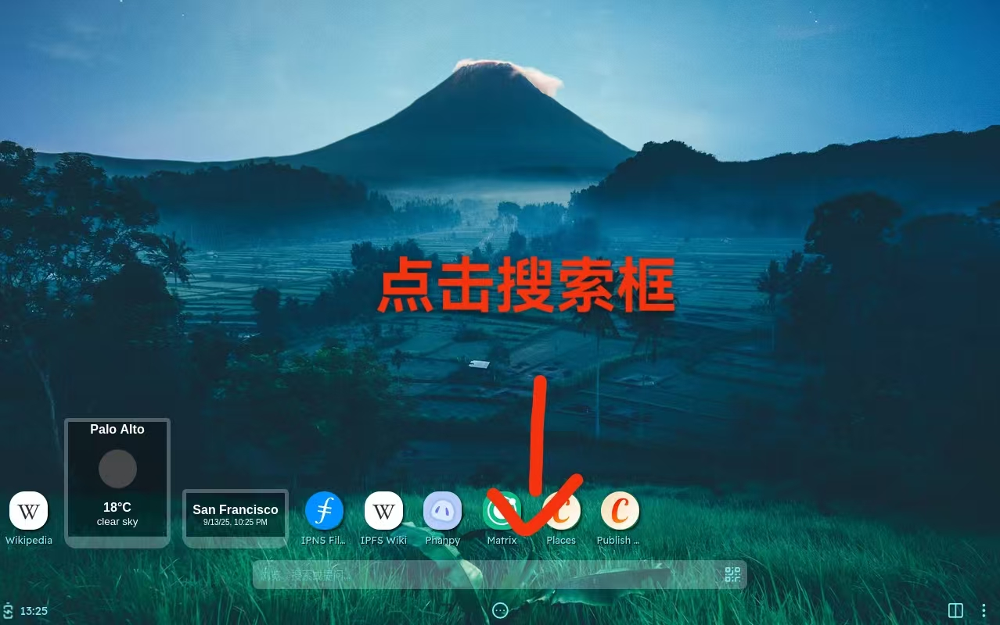
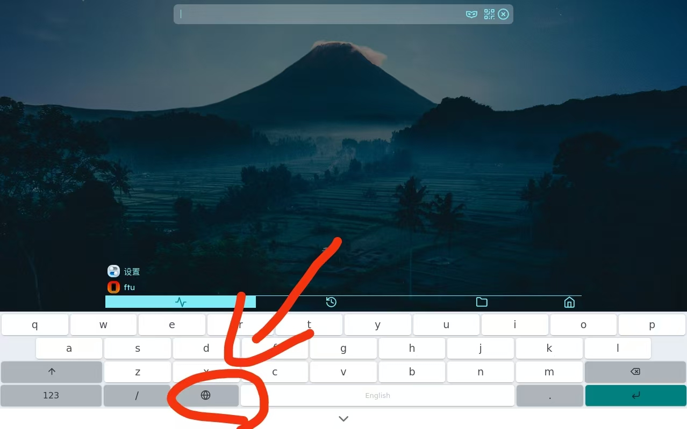
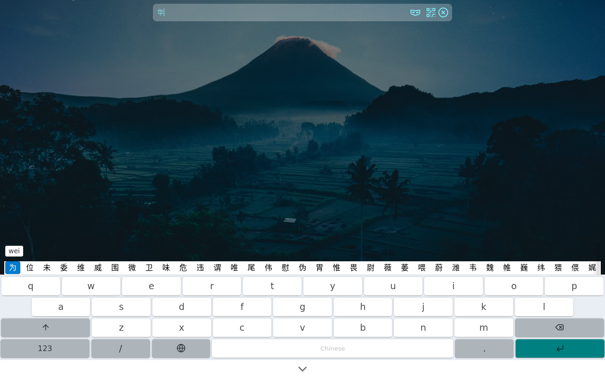

#  中文输入法-移动版

移动模式下的虚拟键盘原本只支持简单的英文输入，我们在此基础上提供了中文输入。该移动版输入法支持标准汉语拼音输入，能够将用户输入的拼音序列转换为对应的汉字，可以根据输入的拼音实时动态显示匹配的候选词列表，可以提供便捷的中英文输入模式切换功能，满足用户在不同场景下的输入需求，还能确保在触屏设备上也能获得良好的用户体验。

用户在移动模式时可以通过点击搜索框输入文字进行搜索。

当用户想在英文输入法和中文输入法做切换时，可以通过点击下图中的图标实现。切换后屏幕中虚拟键盘的空格处会显示此时的输入法种类。

用户通过虚拟键盘输入需要的文字进行搜索。
