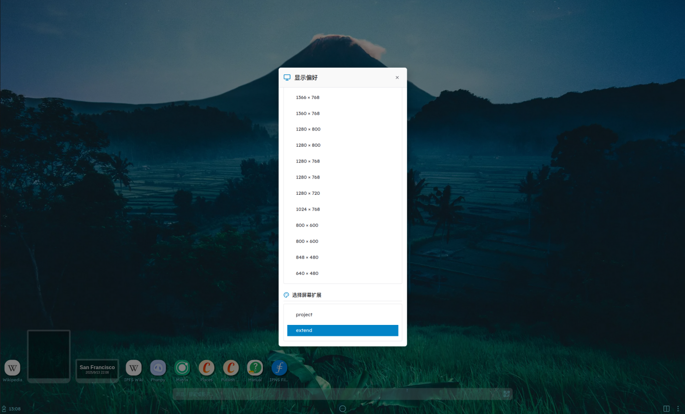

# 显示偏好

本系统支持多样化的显示偏好设置，满足不同用户和场景下的显示需求。主要功能包括分辨率自适应与切换、外接屏幕支持（投影模式与扩展模式）、以及外接屏分辨率调节。

## 分辨率自适应与切换

系统能够根据当前显示设备自动适配最佳分辨率，确保界面元素清晰、布局合理。用户也可以在设置中手动切换分辨率，以适应不同的显示需求。

- **自适应分辨率**：系统开机或连接新显示设备时，会自动检测并应用最合适的分辨率。
- **手动切换分辨率**：用户可在“显示设置”中选择不同的分辨率，实时预览并应用。

## 外接屏幕支持

系统支持通过HDMI、Type-C等接口连接外接显示器，满足多屏办公、演示等需求。

### 投影模式

投影模式下，外接屏幕与主屏幕显示相同内容，适用于会议演示、教学等场景。

### 扩展模式

扩展模式与其他系统不同，手机外接屏幕选择扩展模式后，屏幕会转移到外接屏幕上，从移动模式转为桌面模式。

## 外接屏幕分辨率调节

连接外接屏幕后，系统支持分别为主屏幕和外接屏幕设置分辨率。用户可在“显示设置”中为每个屏幕单独选择合适的分辨率，提升显示效果和使用体验。

如需进一步自定义显示参数，可在“显示设置”中查看更多高级选项。
