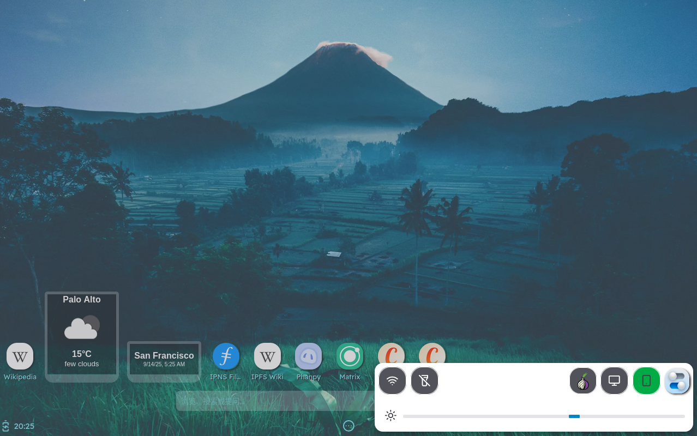
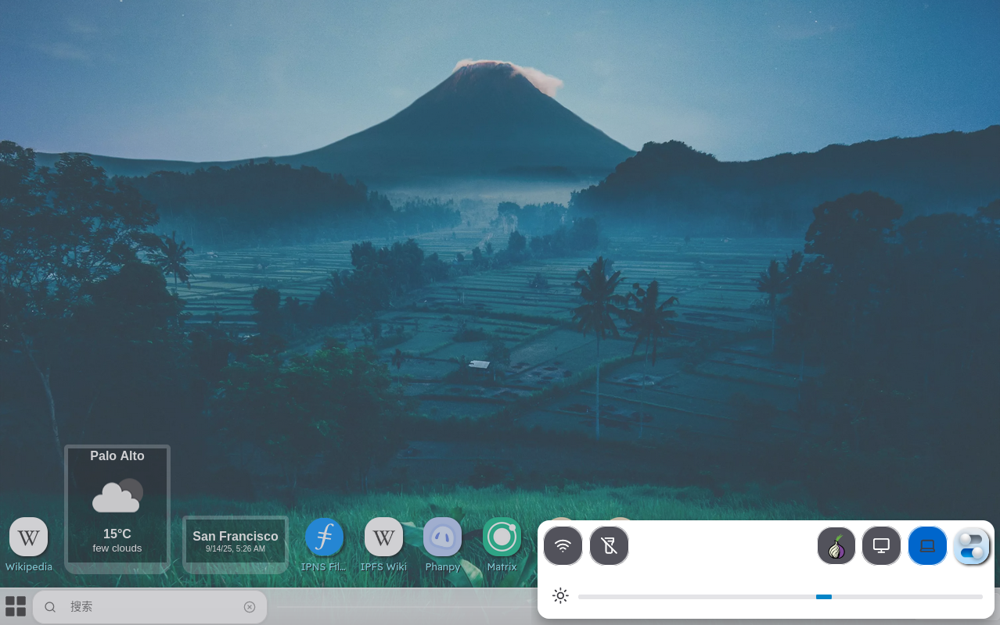
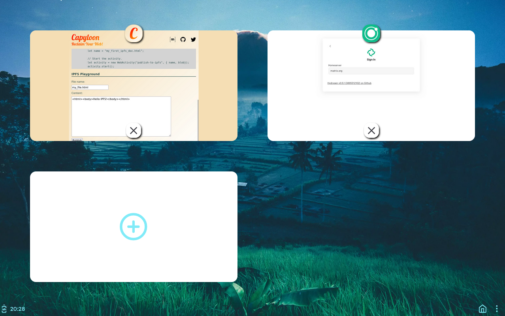
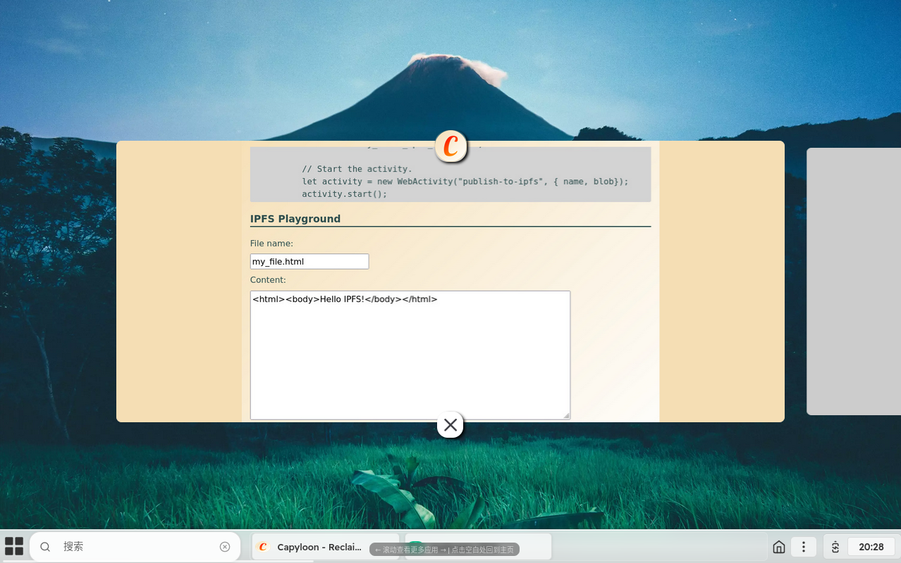

# 模式切换

用户可以通过底部栏中快速应用里提供的模式切换按钮，方便快捷的进行模式切换，桌面模式和移动模式会共享打开的应用。

## 模式切换操作

### 移动模式

用户可以通过单击底部栏右侧的三个点形状的快速应用按钮打开快速应用窗口，其中手机形状的绿色图标代表现在处于移动模式，点击后即可切换到桌面模式。

### 桌面模式

用户可以通过单击底部栏右侧的三个点形状的快速应用按钮打开快速应用窗口，其中电脑形状的蓝色图标代表现在处于桌面模式，点击后即可切换到移动模式。

## 模式切换共享后台应用

### 移动模式

用户可以通过单击底部栏右侧的房子形状的后台应用按钮打开后台应用窗口，打开应用后点击该按钮会回到主界面，但刚刚打开的应用会留存在后台。

### 桌面模式

用户可以通过单击底部栏右侧的房子形状的后台应用按钮打开后台应用窗口，在该窗口使用鼠标滚轮可以查看所有的后台应用，打开应用后点击该按钮会回到主界面，但刚刚打开的应用会在底部栏继续显示，同时留存在后台。

- **在移动模式打开应用并留存在后台，切换到桌面模式，后台留存的应用保持不变，反之亦可**
- **进入后台应用窗口后，点击空白处即可退回到主界面**

