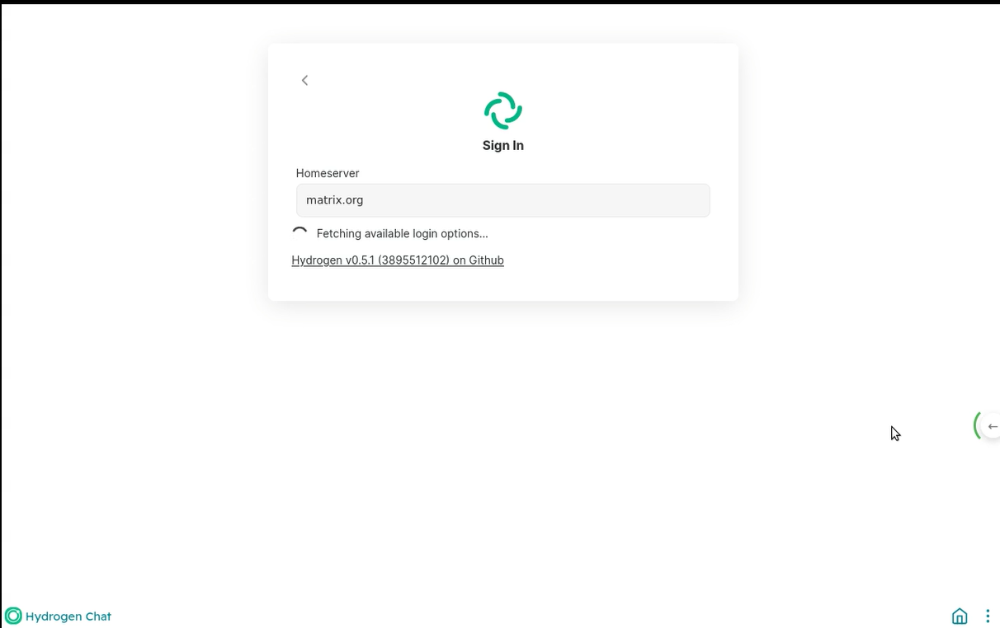
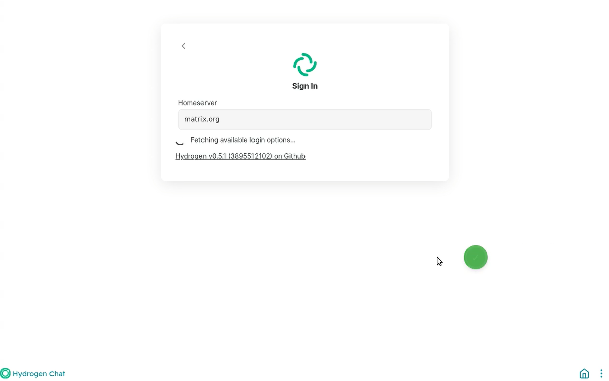
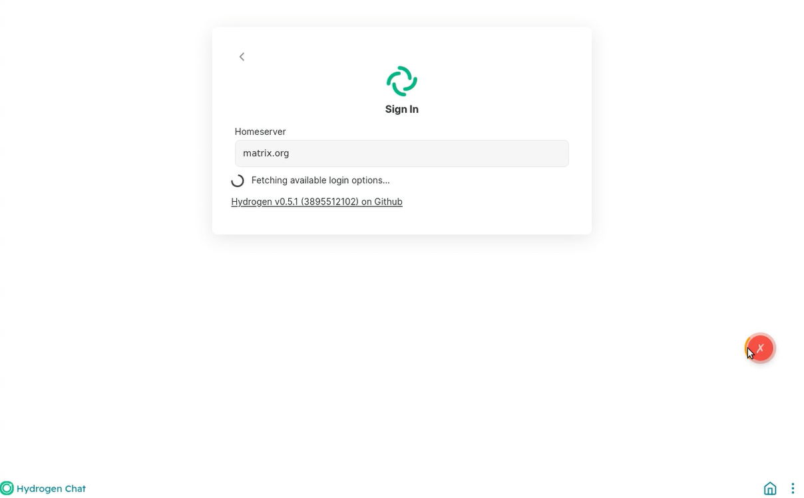

# 移动模式侧边手势滑动

移动模式下的侧边手势滑动功能允许用户通过从屏幕左侧或右侧边缘向内滑动来退出当前应用或返回上一页并显示滑动进度指示器和箭头动画。

### 屏幕侧边手势滑动

用户打开app应用后，可以通过从屏幕左侧或右侧边缘向内滑动来退出当前应用或返回上一页并显示滑动进度指示器和箭头动画。

### 退出应用成功

用户从屏幕边缘开始的有效触发区域开始滑动，并且滑动距离大于触发手势所需的最小滑动距离，同时滑动时间在最大时间限制之内，即可成功退出应用。绿色图标代表侧边手势滑动成功。

### 退出应用失败

用户侧边手势滑动没有达到最小滑动距离或滑动时间超时，退出应用会失败。红色图标代表侧边手势滑动失败。

