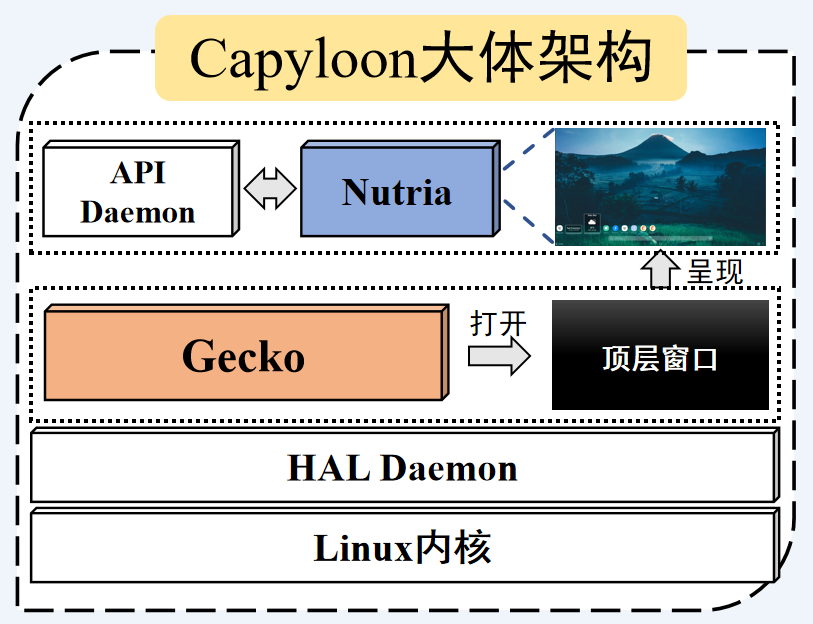
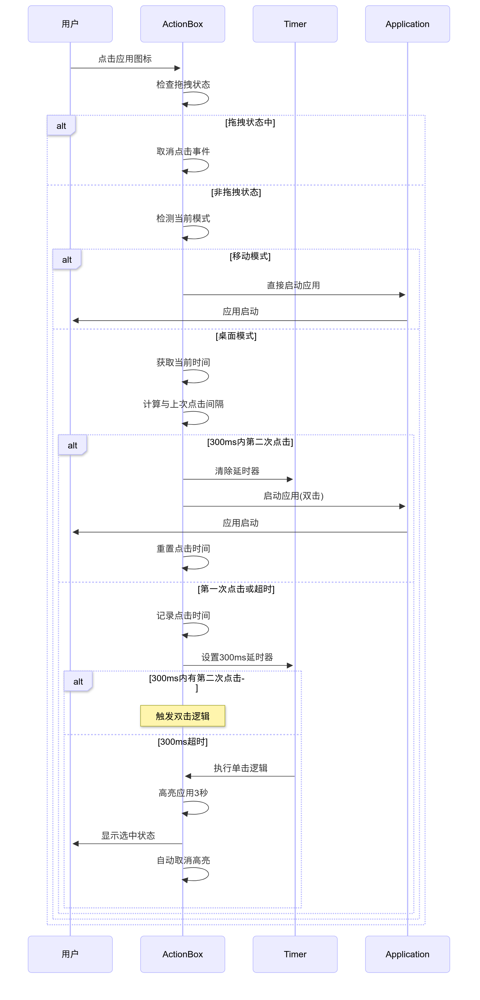
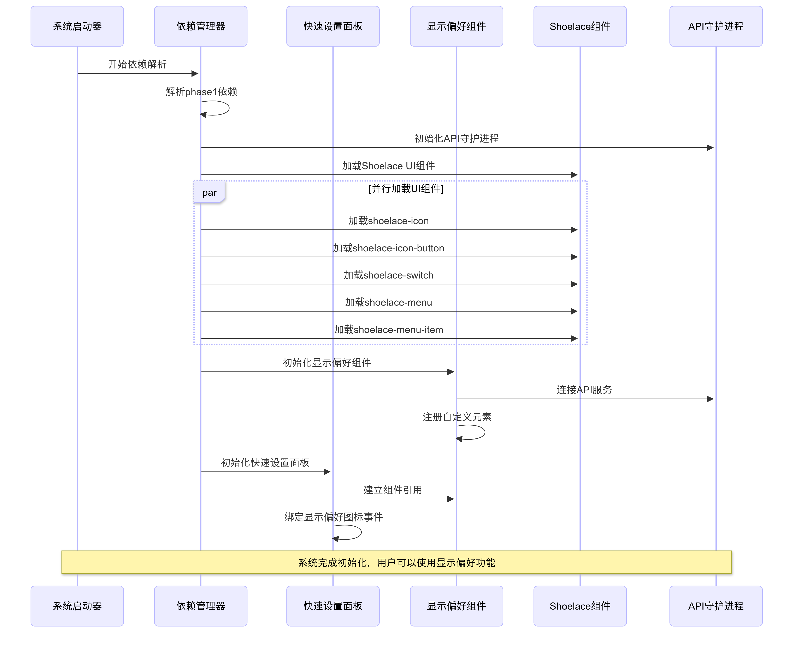
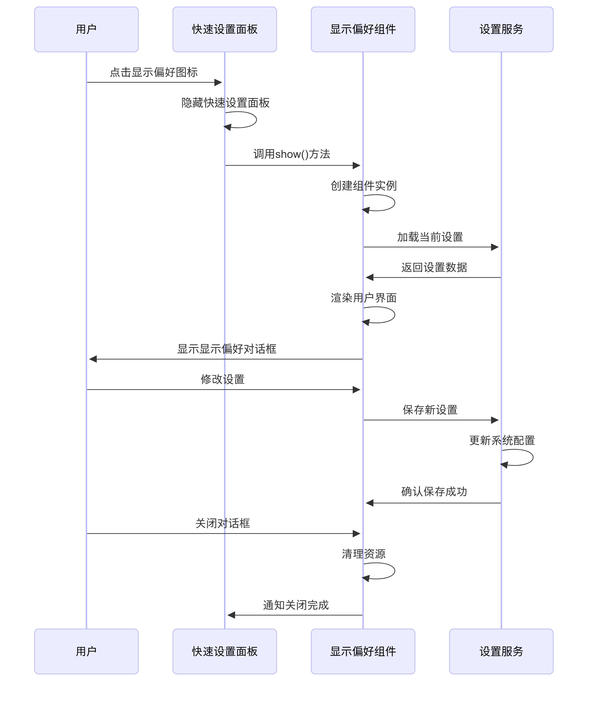
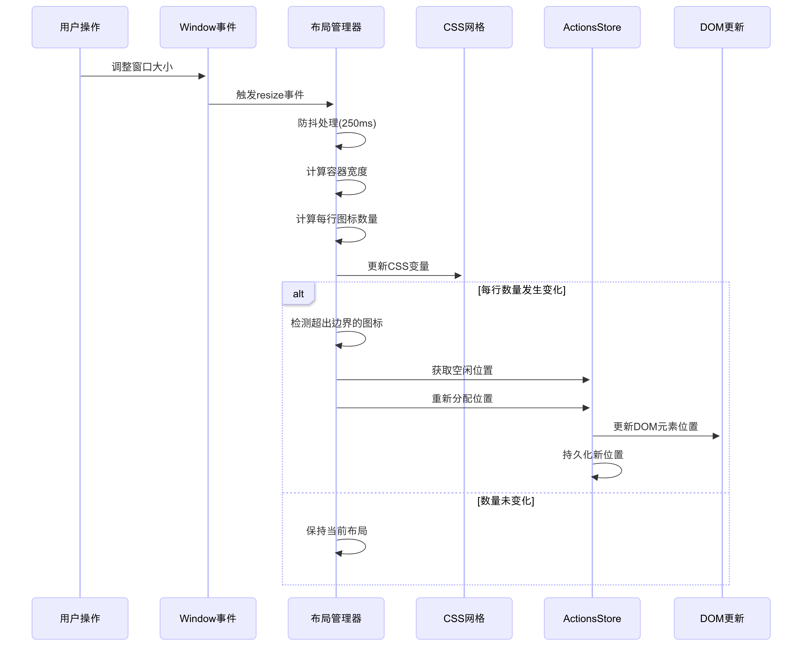

# nutria ------ 设计文档


目录

```
1 概述
2 移动模式功能设计
  2.1 侧边手势滑动功能
  2.2 中文输入法(虚拟键盘)功能
3 桌面模式功能设计
  3.1 桌面应用交互功能
  3.2 桌面底部栏功能
  3.3 中文输入法(键盘)功能
4 双模式通用功能设计
  4.1 多屏控制功能
  4.2 应用图标自适应重排功能
  4.3 录屏功能
  4.4 点击空白退出功能
  4.5 应用图标重叠冲突检测功能
```

# 1 概述

本项目基于开源项目 capyloon 进行扩展，我们在 nutria 中对移动模式与桌面模式进行了全方位的优化与扩展。

本文档旨在为开发者提供我们对 nutria 项目中移动模式与桌面模式的设计方案。减少开发者在使用 nutria 时的学习成本。

下图为 capyloon 各组件直接的关系。


# 2 移动模式功能设计

## 2.1 侧边手势滑动功能

移动模式下的侧边手势滑动功能允许用户通过从屏幕左侧或右侧边缘向内滑动来退出当前应用或返回上一页并显示滑动进度指示器和箭头动画。

---
### 2.1.1 设计目标
- 提供直观的移动设备交互体验
- 增强单手操作的便利性
- 与现有的 nutria 导航系统无缝集成
- 确保在桌面模式下不会误触发

---
### 2.1.2 技术参数

| 参数名称 | 默认值 | 说明 |
|---------|--------|------|
| 边缘检测宽度 | 30px | 从屏幕边缘开始的有效触发区域 |
| 最小滑动距离 | 60px | 触发手势所需的最小滑动距离 |
| 最大滑动时间 | 1500ms | 完成手势的最大时间限制 |
| 最大垂直偏移 | 150px | 允许的最大垂直方向偏移量 |
| 防抖间隔 | 400ms | 连续手势之间的最小间隔时间 |

---
### 2.1.3 手势检测流程

下图为系统对用户手势滑动的检测流程。


---
### 2.1.4 边缘检测算法


边缘检测算法是手势滑动功能的核心组件，负责判断触摸点是否位于屏幕边缘、滑动距离和方向是否有效，并对手势进行防抖处理。

| 属性 | 值 |
|------|-----|
| **模块名称** | EdgeSwipeDetector |
| **文件路径** | apps/system/components/edge_swipe_detector.js |
| **模块类型** | 功能模块（ES模块） |
| **依赖关系** | 无外部依赖 |
| **输入参数** | clientX, clientY, startX, startY, edgeWidth, windowWidth, windowHeight, direction, timestamp |
| **输出结果** | { isFromLeftEdge, isFromRightEdge, isValidSwipe }, Boolean |
| **主要功能** | 检测触摸点是否在屏幕边缘，判断滑动距离/方向/时间是否有效，防抖处理 |
| **核心方法** | isFromEdge(x), isValidSwipe(start, end, direction, time), getEdgeType(x), resetDebounce() |
| **性能要求** | < 1ms 响应时间 |
| **测试覆盖率** | 95% |

---
## 2.2 中文输入法(虚拟键盘)功能

移动模式下的虚拟键盘原本只支持简单的英文输入，我们在此基础上提供了中文输入。

---
### 2.2.1 设计目标
- **全平台兼容:** 支持桌面浏览器与移动设备，适配鼠标、触摸板、触摸屏输入。
- **中文输入支持:** 以拼音输入为核心，支持智能候选词生成与选择。
- **输入预览与候选栏:** 实时显示输入内容与候选词，支持滑动浏览。
- **键盘布局可配置:** 支持多种布局(如拼音、英文)动态切换。
- **视觉反馈清晰:** 按键状态(按下、激活)、候选词高亮、滚动提示等均有明确反馈。

---
### 2.2.2 系统架构概览

| 层级 | 组件 | 说明 |
|------|-----|-----|
| **视图层** | HTML + CSS | 负责 UI 布局与样式渲染 |
| **逻辑层** | KeyboardLayout 类 | 核心状态管理与交互逻辑 |
| **数据层** | chinese.json | 候选词字典(拼音 → 汉字映射) |
| **平台接口** | navigator.b2g.inputMethod | 调用 Gecko 输入接口 |

---
### 2.2.3 核心类：KeyboardLayout

| 参数 | 类型          | 说明                           |
| :--- | :------------ | :----------------------------- |
| root | HTMLElement   | 虚拟键盘的根容器(即 `#vkb`) |

**初始化行为**：

1.  设置初始状态(输入文本、候选词、布局等)
2.  获取 DOM 元素引用
3.  加载中文词库(`chinese.json`)
4.  绑定全局事件(`pointerdown/up`, `hashchange`)
5.  初始化候选词栏滑动逻辑

---
### 2.2.4 核心状态管理

| 状态变量         | 类型       | 说明 |
| :--------------- | :--------- | :---- |
| `inputText`      | `string`   | 当前输入的拼音或英文内容    |
| `committedText`  | `string`   | 已上屏的中文文本    |
| `candidateList`  | `string[]` | 当前匹配的候选词列表   |
| `candidatePinList` | `string[]` | 对应候选词的拼音前缀(用于分段输入) |
| `highlightedIndex` | `number`   | 当前高亮候选词索引     |
| `currentLayout`  | `object`   | 当前激活的键盘布局对象      |
| `currentView`    | `string`   | 当前显示的视图(如 `standard`)   |

---
### 2.2.5 输入处理流程

#### 1. 字符输入(`appendToInputText(char)`)
- 将字符追加到 `inputText`
- 查询 `CNdata` 获取匹配候选词
- 更新 `candidateList` 和 `candidatePinList`
- 调用 `updateInputText()` 刷新 UI

#### 2. 回退删除(`backspaceFromInputText()`)
- 删除 `inputText` 最后一个字符
- 重新匹配候选词
- 更新 UI

#### 3. 上屏候选词(`commitText(index)`)
- 根据索引从 `candidateList` 获取汉字
- 若拼音完全匹配，则调用 `endComposition()` 上屏并清空
- 否则保留未完成部分，进入“分段输入”模式
- 更新 `committedText` 和预览栏

#### 4. 分段输入(`reInputText(text)`)
- 处理不完全匹配的拼音(如输入“nihao”，选择“你”后剩余“hao”)
- 重新匹配剩余拼音的候选词
- 保持 `committedText` 不变

---
### 2.2.6 候选词系统

#### 候选词展示(`showCandidates(words)`)
- 动态创建 `<span class="candidate-item">`
- 绑定 `pointerdown` 事件实现：
  - **点击选择**：直接上屏
  - **滑动操作**：手动滚动候选栏(防止误触)
- 支持横向滑动浏览(`touchstart/move/end`)

#### 高亮控制(`updateCandidateHighlight()`)
- 通过 `highlighted` class 控制当前选中项

---
### 2.2.7 键盘布局系统

#### 动态加载(`loadLayout(name)`)
- 使用 `import()` 动态加载 `../layouts/${name}.js`
- 缓存到 `this.layouts` 对象

#### 视图构建(`buildView(name)`)
- 解析布局定义中的 `views[viewName]`
- 生成 DOM 片段(`DocumentFragment`)
- 支持自定义：
  - 显示文本 / 图标(`<lucide-icon>`)
  - 样式(`style-primary`, `style-secondary`)
  - 尺寸(`size-wide`, `size-large`)
  - 行为绑定(`behavior.press`, `behavior.longpress`)

#### 视图切换(`switchToView(viewName)`)
- 替换 `#vkb` 内容
- 支持临时视图(`switch-tempview`)

---
### 2.2.8 事件处理机制

#### 事件委托
- 在 `#vkb` 上监听 `pointerdown/up`, `contextmenu`
- 通过 `data-key` 向上查找目标键

#### 事件流程
| 事件  | 行为  |
| :------------ | :--------------------------------------------- |
| `pointerdown` | 添加 `active` 样式、震动反馈、显示按键气泡     |
| `pointerup`   | 移除 `active`、执行按键行为(`press` 命令)    |
| `contextmenu` | 触发长按行为(`longpress` 命令)               |

#### 特殊按键处理
| 按键  | 行为 |
| :---------- | :----- |
| `Space`     | 选择高亮候选词(若有)，否则发送空格       |
| `Backspace` | 删除字符或退格                             |
| `Enter`     | 上屏当前输入内容    |
| `Layout Key`| 切换中英文布局    |

---
### 2.2.9 UI 交互细节

#### 输入预览栏(`#input-preview-bar`)
- 显示已上屏文本 + 当前输入(用 `'` 分隔)
- 右侧渐变遮罩提示可滑动
- 候选词栏横向滑动支持(`touchmove` + `preventDefault`)

#### 按键反馈
- **视觉**：`active` class 实现按下态
- **触觉**：`navigator.vibrate(10)` 短震动
- **气泡提示**：短暂显示按键字符

---
### 2.2.10 扩展性设计

#### 布局扩展
- 新增语言只需添加 `layouts/xx-XX.js` 文件
- 支持多视图(数字、符号、功能键)

#### 行为扩展
- 通过 `behavior` 字段绑定命令
- `processCommand()` 支持自定义指令(如 `switch-view`, `next-layout`)

#### 数据扩展
- `chinese.json` 可替换为更完整的词库
- 支持动态学习用户输入习惯(未来方向)

---

## 2.2.11 总结

该移动版输入法系统实现了以下核心功能与特性：

- ✅ **中文拼音输入核心功能**：支持标准汉语拼音输入，能够将用户输入的拼音序列转换为对应的汉字。

- ✅ **候选词动态匹配与选择**：根据输入的拼音实时动态显示匹配的候选词列表。

- ✅ **中英文布局切换**：提供便捷的中英文输入模式切换功能，满足用户在不同场景下的输入需求。

- ✅ **触控友好交互设计**：界面元素大小适配触控操作，确保在触屏设备上也能获得良好的用户体验。

- ✅ **模块化、可扩展架构**：系统采用模块化设计，便于后续功能的增加、修改和维护，具有良好的可扩展性。

---
# 3.桌面模式功能设计

## 3.1 桌面应用交互功能

桌面应用交互功能基于`<action-box>`自定义元素实现，为桌面模式提供完整的应用交互体验，包括双击启动、右键菜单、拖拽管理等功能。该系统能够根据运行模式(桌面/移动)自动调整交互方式，确保在不同设备上都能提供最适合的用户体验。

---
### 3.1.1 设计目标

- **经典桌面体验:** 提供与传统桌面操作系统一致的双击启动交互
- **模式自适应:** 根据当前模式(桌面/移动)自动调整交互方式
- **精确双击检测:** 实现可靠的双击识别算法，避免误触发
- **完整上下文操作:** 提供右键菜单支持应用管理操作
- **多设备兼容:** 支持鼠标、触摸板、触摸屏等多种输入设备
- **视觉反馈:** 提供清晰的选中状态和操作反馈

---
### 3.1.2 核心架构

ActionBox是桌面应用交互的核心Web Component，采用Shadow DOM封装实现，集成了双击检测、右键菜单、应用启动等完整的桌面交互功能。

| 属性 | 值 |
|------|-----|
| **模块名称** | ActionBox |
| **文件路径** | apps/homescreen/components/action_box.js |
| **模块类型** | Web Component (Custom Element) |
| **继承关系** | HTMLElement |
| **Shadow DOM** | 开放模式 ({ mode: "open" }) |
| **样式依赖** | components/action_box.css |
| **状态属性** | longPress, contextMenuActive, isDesktop, lastClickTime, doubleClickDelay, clickTimeout, isDragging |
| **事件支持** | click, contextmenu, pointerdown, pointerup |
| **子组件** | slot, ghost, menu, context-menu |
| **生命周期** | constructor(), connectedCallback(), attributeChangedCallback() |
| **观察属性** | position |
| **核心常量** | kLongPressDelay = 300ms |

---
### 3.1.3 技术参数

| 参数名称 | 默认值 | 说明 |
|---------|--------|------|
| 双击时间间隔 | 300ms | doubleClickDelay - 两次点击之间的最大时间间隔 |
| 长按触发时间 | 300ms | kLongPressDelay - 长按手势触发的时间阈值 |
| 选中状态持续时间 | 3000ms | 单击选中后的高亮状态持续时间（桌面模式） |
| 菜单边界距离 | 10px | 上下文菜单距离屏幕边缘的最小距离 |
| 菜单层级 | 9999 | 确保菜单显示在最顶层 |
| 高亮淡出延迟 | 300ms | 单击高亮效果的延迟执行时间 |

---
### 3.1.4 双击检测机制

双击检测系统通过时间间隔判断和模式适配实现精确的双击识别，下图为桌面应用双击交互流程：



双击检测算法通过高精度时间戳比较和状态管理，实现可靠的双击识别，同时支持桌面模式和移动模式的不同交互逻辑。

| 属性 | 值 |
|------|-----|
| **模块名称** | DoubleClickDetectionModule |
| **文件路径** | apps/homescreen/components/action_box.js |
| **模块类型** | 事件处理模块 |
| **依赖关系** | Date.now(), setTimeout, clearTimeout |
| **输入参数** | event, lastClickTime, doubleClickDelay, isDesktop, clickTimeout |
| **输出结果** | Boolean, setTimeout ID |
| **主要功能** | 检测双击事件，区分单击和双击操作，支持延迟高亮 |
| **核心方法** | handleEvent(), openApplication(), highlightApp() |
| **时间精度** | 1ms (Date.now()) |
| **响应延迟** | ≤ 300ms (doubleClickDelay) |
| **状态管理** | lastClickTime, clickTimeout, isDragging, cancelClick |
| **模式适配** | 桌面模式双击/移动模式单击 |

---
### 3.1.5 应用启动处理

应用启动管理器提供统一的应用启动接口，支持多种应用类型的启动方式，包括书签、活动和通用应用，并管理应用的选中状态。

| 属性 | 值 |
|------|-----|
| **模块名称** | ApplicationLauncherModule |
| **文件路径** | apps/homescreen/components/action_box.js |
| **模块类型** | 应用管理模块 |
| **依赖关系** | ActionBox, Shadow DOM, slot elements |
| **支持类型** | ACTION-BOOKMARK, ACTION-ACTIVITY, 通用应用 |
| **输出结果** | CustomEvent('open-app'), Boolean |
| **主要功能** | 统一应用启动接口，支持多种应用类型，slot元素检测 |
| **核心方法** | openApplication(), highlightApp(), querySelector() |
| **事件传播** | bubbles: true, detail: { actionId, fromDoubleClick } |
| **状态管理** | 应用选中状态，3秒自动清除，全局高亮清除 |
| **检测策略** | tagName检测 → 方法调用 → click触发 → 事件分发 |

---
### 3.1.6 右键上下文菜单

右键上下文菜单作为桌面应用交互系统的重要组成部分，为用户提供快速访问应用操作的便捷方式。菜单系统集成在`ActionBox`组件中，支持智能定位、模式感知和全局菜单管理。

#### 菜单结构设计

上下文菜单组件通过Shadow DOM实现样式隔离，采用固定的菜单项结构，支持图标和文本的组合显示，确保用户界面的一致性。

| 属性 | 值 |
|------|-----|
| **模块名称** | ContextMenuComponent |
| **文件路径** | apps/homescreen/components/action_box.js |
| **模块类型** | UI组件模块 |
| **DOM结构** | Shadow DOM封装 |
| **菜单项数量** | 2个(打开应用、删除应用) |
| **图标库** | Shoelace Icons (sl-icon) |
| **CSS类名** | context-menu, context-menu-item, context-menu-separator |
| **数据属性** | data-action="open", data-action="delete" |
| **显示状态** | hidden(默认), visible(移除hidden类) |
| **层级管理** | z-index: 9999 |
| **模式样式** | desktop-mode, mobile-mode CSS类 |
| **图标配置** | external-link(打开), trash-2(删除) |

#### 右键菜单交互流程

右键菜单的完整交互流程包括显示、定位、操作和隐藏：


智能定位算法确保上下文菜单在任何屏幕位置都能正确显示，通过边界检测和位置调整，避免菜单超出视口范围。

| 属性 | 值 |
|------|-----|
| **模块名称** | MenuPositioningModule |
| **文件路径** | apps/homescreen/components/action_box.js |
| **模块类型** | 算法模块 |
| **依赖关系** | DOM API, getBoundingClientRect, window.innerWidth/Height |
| **输入参数** | event.clientX, event.clientY, menuRect, viewportWidth, viewportHeight |
| **输出结果** | { left, top } |
| **主要功能** | 菜单智能定位，边界检测与调整，position: fixed定位 |
| **核心方法** | showContextMenu(), hideAllContextMenus(), getBoundingClientRect() |
| **边界保护** | 10px 最小边距 |
| **计算精度** | 像素级别 |
| **定位策略** | 临时定位 → 尺寸获取 → 边界计算 → 最终定位 |
| **事件绑定** | click, contextmenu, keydown(Escape) 全局监听 |

---
### 3.1.7 事件处理机制

统一事件处理器负责协调双击检测和右键菜单的事件处理，通过单一入口管理多种交互事件，确保事件处理的一致性和效率。

| 属性 | 值 |
|------|-----|
| **模块名称** | UnifiedEventHandlerModule |
| **文件路径** | apps/homescreen/components/action_box.js |
| **模块类型** | 事件处理模块 |
| **处理事件** | click, contextmenu, pointerdown, pointerup |
| **事件阶段** | capture: true (Shadow DOM事件监听) |
| **状态管理** | longPress, contextMenuActive, isDragging, cancelClick |
| **主要功能** | 统一处理双击检测和右键菜单事件，长按检测，拖拽状态管理 |
| **核心方法** | handleEvent(), handleContextMenuClick(), setPointerCapture() |
| **事件传播** | stopPropagation(), preventDefault() |
| **模式适配** | 桌面模式/移动模式自动切换 |
| **定时器管理** | kLongPressDelay(300ms), window.setTimeout/clearTimeout |
| **指针捕获** | capturedPointerId, setPointerCapture() |

---
### 3.1.8 全局菜单管理

全局菜单状态管理器确保整个系统中同时只有一个上下文菜单处于活动状态，通过全局事件监听和状态协调，提供一致的菜单体验。

| 属性 | 值 |
|------|-----|
| **模块名称** | GlobalMenuManagerModule |
| **文件路径** | apps/homescreen/components/action_box.js |
| **模块类型** | 状态管理模块 |
| **管理范围** | 全局所有ActionBox实例 |
| **选择器** | document.querySelectorAll('action-box') |
| **主要功能** | 确保单一菜单活动状态，全局事件监听，Shadow DOM菜单查询 |
| **核心方法** | hideAllContextMenus(), hideContextMenuHandler(), hideContextMenuOnEscape() |
| **监听事件** | click, contextmenu, keydown(Escape) |
| **事件委托** | document级别，capture: true |
| **状态切换** | contextMenuActive boolean标志 |
| **菜单查询** | shadowRoot?.querySelector('.context-menu') |
| **键盘支持** | Escape键关闭菜单 |
| **事件清理** | removeEventListener自动清理 |

---
### 3.1.9 模式自适应

桌面应用交互系统根据当前模式自动调整交互方式：

- **桌面模式** (`this.isDesktop = true`): 
  - 单击选中(高亮3秒)
  - 双击启动应用
  - 右键显示上下文菜单
  
- **移动模式** (`this.isDesktop = false`):
  - 单击直接启动应用
  - 长按触发应用管理
  - 禁用右键菜单

这种设计确保了桌面应用交互的一致性和流畅性，用户可以通过双击启动应用、右键快速访问应用操作，同时保持与系统其他组件的无缝配合。

---
## 3.2 桌面底部栏功能

桌面底部栏是基于`<system-statusbar>`自定义元素实现的核心UI组件，通过CSS类`.desktop-mode`切换到桌面模式布局。底部栏集成了搜索功能、运行应用管理、系统状态显示等关键功能，并支持响应式布局适配不同屏幕尺寸。

---
### 3.2.1 设计目标

- **模式自适应:** 根据`.desktop-mode`类自动切换桌面/移动布局模式
- **搜索集成:** 内置搜索面板支持应用、文件、联系人等多源搜索
- **应用管理:** 显示运行中应用列表，支持切换和关闭操作
- **响应式设计:** 根据窗口大小动态调整组件布局和可见性
- **系统状态:** 集成电池、网络、时间等系统状态指示器

---
### 3.2.2 核心架构

StatusBar是桌面底部栏的主控制器，作为Web Component实现，负责协调搜索面板、应用列表和系统托盘等子组件的工作。

| 属性 | 值 |
|------|-----|
| **模块名称** | SystemStatusbar |
| **文件路径** | apps/system/components/status_bar.js |
| **模块类型** | Web Component (Custom Element) |
| **继承关系** | HTMLElement |
| **CSS类控制** | .desktop-mode, .transparent, .search-panel-open |
| **子模块** | SearchPanel, FrameList, SystemTray |
| **状态属性** | isDesktopMode, searchPanelOpen, frameListItems |
| **事件监听** | desktop-mode-changed, resize, focus, blur |
| **主要功能** | 桌面底部栏UI管理，模式切换，响应式布局，搜索集成 |
| **生命周期** | constructor(), connectedCallback(), render() |
| **布局结构** | 三栏式(.left, .center, .right) |
| **容器类型** | CSS Grid(移动) / Flexbox(桌面) |

---
### 3.2.3 技术参数

| 参数名称 | 实际值 | 说明 |
|---------|--------|------|
| 桌面模式高度 | 48px | `--statusbar-desktop-height` |
| 搜索框宽度 | 100% | 填满search-panel的空间 |
| 搜索框最小宽度 | 200px | 最小宽度保证可用性 |
| 搜索框最大宽度 | 320px | 设置最大宽度，让搜索框不会过长 |
| 桌面模式背景 | rgba(240,240,240,0.95) | 半透明白色背景 |
| 文字颜色 | #333 | 深色文字确保可读性 |
| 模糊效果 | blur(15px) saturate(1.2) | backdrop-filter毛玻璃效果 |
| 阴影效果 | 0 -3px 15px rgba(0,0,0,0.2) | 上方投影营造悬浮感 |
| 边框效果 | 1px solid rgba(255,255,255,0.3) | 顶部白色半透明边框 |
| 层级管理 | z-index: 500 | 确保在其他元素之上 |
| 搜索面板层级 | z-index: 2000 | 打开时覆盖所有元素 |

---
### 3.2.4 搜索面板功能

多源搜索引擎整合了系统中的各种数据源，提供统一的搜索入口，支持实时搜索和智能结果排序，为用户提供快速便捷的信息查找体验。

| 属性 | 值 |
|------|-----|
| **模块名称** | SearchPanel |
| **文件路径** | apps/system/js/search_panel.js |
| **模块类型** | ES6 Class模块 (export class) |
| **搜索源数量** | 7个 |
| **支持源类型** | MediaSource, PlacesSource, SkillsSource, ContactsSource, AppsSource, TopSitesSource, SearchActivitySource |
| **输入方式** | 实时输入(input事件), 回车键确认(keypress事件) |
| **搜索阈值** | 2个字符起搜索 |
| **结果限制** | 每源最多7条结果 |
| **主要功能** | 全局统一搜索，多源结果聚合，URL处理，私密浏览支持，桌面模式适配 |
| **核心方法** | init(), handleEvent(), handleEnterKey(), maybeOpenURL(), mergeDom(), onOpen(), onClose() |
| **事件监听** | input, keypress, pointerdown, desktop-mode-changed, transitionend |
| **URL支持协议** | http/https, file://, ipfs://, ipns://, tile://, about: |
| **搜索引擎集成** | OpenSearch, DuckDuckGo(默认fallback) |
| **窗口管理** | window.wm.openFrame(), WebActivity |
| **私密浏览** | 支持toggle切换，传递给打开的页面 |
| **虚拟键盘处理** | 桌面模式自动管理focus/blur |

---
### 3.2.5 运行应用管理

任务栏应用管理器负责维护和显示当前运行的应用程序列表，提供应用切换、状态指示和上下文操作等功能，是桌面多任务管理的核心组件。

| 属性 | 值 |
|------|-----|
| **模块名称** | TaskbarFrameManagerModule |
| **文件路径** | apps/system/components/status_bar.js |
| **模块类型** | 应用管理模块 |
| **依赖关系** | WindowManager, frame-list元素 |
| **管理对象** | 运行中应用窗口(filteredFrames) |
| **过滤规则** | 排除homescreen、system、about:、空白页、本地文件 |
| **主要功能** | 任务栏应用列表更新，切换，右键菜单，音频控制 |
| **核心方法** | updateFrameList(), adjustFrameListLayout(), setupResizeObserver() |
| **事件支持** | click(切换), contextmenu(菜单), frameopen/close/activate |
| **状态指示** | active状态，audio图标，favicon显示 |
| **布局模式** | 标准模式(图标+标题) / 紧凑模式(仅图标) |
| **响应式调整** | ResizeObserver监听，动态切换布局模式 |
| **音频管理** | volume-1/volume-x图标，toggleMutedState() |
| **标题处理** | 20字符限制，超长显示省略号 |
| **桌面模式专用** | 移动模式下完全隐藏frame-list |

---
### 3.2.6 响应式布局系统

响应式布局控制器通过多断点设计实现底部栏在不同屏幕尺寸下的自适应显示，确保在各种设备上都能提供最佳的用户体验。

| 属性 | 值 |
|------|-----|
| **模块名称** | ResponsiveLayoutModule |
| **文件路径** | apps/system/components/status_bar.js |
| **模块类型** | 响应式布局模块 |
| **断点设置** | 动态计算，基于应用数量和容器宽度 |
| **适配策略** | 标准模式 ↔ 紧凑模式动态切换 |
| **桌面模式** | frame-list显示，完整功能 |
| **移动模式** | frame-list隐藏，简化布局 |
| **主要功能** | 多屏幕尺寸适配，组件可见性控制，动态布局调整 |
| **控制属性** | display, clientWidth, compact-mode class |
| **监听机制** | ResizeObserver实时监听容器尺寸变化 |
| **防抖处理** | 100ms防抖避免频繁调整 |
| **计算逻辑** | averageItemWidth < compactThreshold触发紧凑模式 |
| **阈值算法** | Math.max(60, 120 - frameCount * 5) |

底部栏与系统各组件的交互流程：


---
### 3.2.7 事件处理机制

StatusBar事件管理器负责处理底部栏的各种用户交互事件，包括搜索框焦点管理、模式切换响应和窗口大小变化适配。

| 属性 | 值 |
|------|-----|
| **模块名称** | StatusBarEventHandlerModule |
| **文件路径** | apps/system/components/status_bar.js |
| **模块类型** | 事件管理模块 |
| **监听事件** | click, contextmenu, frameopen, frameclose, frameactivate, update-frame-list |
| **事件范围** | frame-list点击切换，右键菜单，应用框架变化，搜索面板 |
| **延迟处理** | 100ms ResizeObserver防抖，10ms布局调整延迟 |
| **主要功能** | 应用切换管理，音频控制，任务栏菜单，响应式布局更新 |
| **核心方法** | onclick, oncontextmenu, frameChangeListener, adjustFrameListLayout |
| **状态切换** | 桌面/移动模式切换，搜索面板开关，紧凑模式切换 |
| **布局更新** | 实时响应式断点调整，动态紧凑模式切换 |
| **音频处理** | volume图标点击事件，toggleMutedState调用 |
| **菜单管理** | showTaskbarContextMenu桌面模式右键菜单 |
| **框架管理** | WindowManager事件监听，应用列表实时更新 |

---
### 3.2.8 模式切换机制

模式切换机制通过QuickSettings组件实现桌面模式和移动模式之间的动态切换，包含模式状态管理、界面更新、虚拟键盘控制等核心功能。

| 属性 | 值 |
|------|-----|
| **模块名称** | QuickSettings (模式切换功能) |
| **文件路径** | apps/system/components/quick_settings.js |
| **模块类型** | JavaScript Web Component |
| **切换方法** | handleNewModeClick() |
| **状态属性** | this.isDesktop (Boolean) |
| **初始化检测** | embedder.sessionType检测 |
| **界面更新** | updateModeToggleButton() |
| **图标状态** | laptop(桌面模式), smartphone(移动模式) |
| **键盘控制** | embedder.useVirtualKeyboard |
| **事件广播** | desktop-mode-changed (CustomEvent) |
| **集成组件** | apps-list桌面模式同步 |
| **设置应用** | applyDesktopModeSettings() |

**核心功能实现：**
- **模式检测**: `embedder.sessionType === "desktop" || embedder.sessionType === "session"`
- **状态切换**: `this.isDesktop = !this.isDesktop`
- **虚拟键盘管理**: 桌面模式禁用，移动模式启用
- **组件通知**: 通过actionsDispatcher和CustomEvent广播模式变更
- **图标动态更新**: variant="primary"，title提示文本自动切换

这种设计实现了系统级的模式切换，确保所有相关组件能够同步响应模式变更，提供一致的用户体验。

---
## 3.3 中文输入法(键盘)功能

我们实现了一套完整的**桌面级中文拼音输入法解决方案**。系统深度集成于窗口管理器（`WindowManager`），通过全局键盘事件监听实现中英文无缝切换与候选词交互。

核心特性包括：
- 全局快捷键拦截与处理（支持 `Alt` / `Ctrl` + 组合键）
- 基于 `navigator.b2g.inputMethod` 的 IME 协议通信
- 动态候选词生成与分页展示（每页 7 项）
- 键盘导航支持（方向键、数字键、空格选择）
- 输入状态持久化与上下文感知
- 高可扩展的模块化架构

---

### 3.3.1 系统架构概览

| 层级 | 组件 | 说明 |
|------|------|------|
| **宿主环境** | `embedder` | 提供系统级事件接口（`addSystemEventListener`）和会话控制 |
| **输入法引擎** | `WindowManagerKeys` 类 | 核心逻辑控制器，绑定全局键盘事件 |
| **词库数据** | `chinese.js` (CNdata) | 拼音到汉字的映射字典（JSON 结构） |
| **UI 层** | 动态创建的 DOM 元素 | 浮层候选词容器（`#ime-candidate-container`） |
| **平台接口** | `navigator.b2g.inputMethod` | 与系统输入框架通信（上屏、组合输入） |

---
### 3.3.2 核心类：`WindowManagerKeys`

#### 构造函数与初始化

| 参数 | 类型 | 说明 |
| :--- | :--- | :--- |
| wm   | WindowManager   | 主窗口管理器实例，用于控制窗口切换与状态 |

**初始化行为**：

1.  初始化输入状态变量（`inputText`, `candidateList`, `highlightedIndex`）
2.  创建候选词 UI 容器并注入 `document.body`
3.  注册全局 `keydown` / `keyup` 事件监听
4.  绑定点击事件以清除输入状态

---
### 3.3.3 核心状态管理

| 状态变量             | 类型       | 说明                                           |
| :------------------- | :--------- | :--------------------------------------------- |
| `inputText`          | `string`   | 当前正在输入的拼音字符串（如 `"nihao"`）       |
| `candidateList`      | `string[]` | 当前匹配的所有候选词（如 `["你好", "您"]`）    |
| `candidatePinList`   | `string[]` | 对应候选词的拼音前缀（用于分段输入判断）       |
| `highlightedIndex`   | `number`   | 当前高亮候选词在当前页中的索引（0~6）          |
| `currentPage`        | `number`   | 当前显示的候选词页码（从 0 开始）              |
| `committedText`      | `string`   | 已确认上屏的文本（暂未使用）                   |
| `isShift`, `isCtrlDown`, `isAltDown` | `boolean` | 修饰键状态标志位                        |
| `isCarouselOpen`     | `boolean`  | 任务轮播是否打开（影响按键行为）               |

---
### 3.3.4 输入处理流程

#### 1. 拼音输入触发
- 当用户按下字母键且 Shift 被激活时（`this.isShift === true`）
- 触发 `reInputText(text)` 进行候选词匹配
- 调用 `updateCandidateUI()` 刷新 UI

#### 2. 候选词匹配算法（`reInputText(text)`）
- 采用最长前缀优先匹配策略
- 支持模糊匹配（如输入 `"nihao"` 可匹配 `"你"`、`"好"`、`"你好"`）
- 保留原始拼音片段（`candidatePinList`）用于后续“分段输入”

#### 3. 上屏逻辑（`commitText(index)`）
- 若候选词拼音完全匹配输入内容 → 清空输入框
- 否则保留剩余拼音（如选`"你"`后继续输入`"hao"`），实现连续输入

#### 4. 分页机制
- 每页显示 `CANDIDATES_PER_PAGE = 7` 个候选词
- 支持 `←`/`→` 切换页面，`↑`/`↓` 移动高亮
- 数字键 `1-7` 快速选择当前页候选词
---
### 3.3.5 候选词 UI 子系统
#### UI 结构
```html
<div id="ime-candidate-container">
  <div id="ime-pinyin-display">当前拼音</div>
  <div id="ime-candidate-list">
    <!-- 动态生成：<div>1.你好</div> ... -->
  </div>
</div>
```
#### 样式特征

该输入法模拟器具有以下视觉和布局特征：

*   **固定定位**：始终位于屏幕的**右下角**，通过 `margin: 20px` 与边缘保持距离。
*   **背景**：采用**深色半透明**背景，具体为 `rgba(0, 0, 0, 0.8)`，确保在各种背景下都有良好的可读性。
*   **边框与阴影**：元素具有**圆角边框**和**阴影效果**，提升整体的现代感和立体感。
*   **高亮项**：当前选中的候选词项背景色为**蓝色**（`#0078d7`），清晰指示用户焦点。

#### 交互方式

用户可以通过以下键盘快捷键与输入法模拟器进行交互：

| 操作                  | 行为                     |
| --------------------- | ------------------------ |
| **字母**      | 输入对应的拼音字母       |
| **Backspace** | 删除已输入的最后一个拼音字符 |
| **数字 1-7**  | 选择当前页面对应位置（1-7）的候选词 |
| **Space**     | 确认并输入当前高亮的候选词 |
| **Enter**     | 确认输入当前高亮候选词，并清空整个拼音串 |
| **←**   | 切换到上一页候选词列表（如果存在） |
| **→**  | 切换到下一页候选词列表（如果存在） |
| **↑**  | 在当前页面中，将高亮索引向上移动 |
| **↓**   | 在当前页面中，将高亮索引向下移动 |
---
### 3.3.6 事件处理机制

#### 全局事件监听

*   使用 `embedder.addSystemEventListener("keydown/up", this)` 实现全局按键事件的监听。

*   保证即使焦点不在输入框也能捕获按键。

#### 冲突规避
*   所有中文输入相关操作均需 `Control + Space` 激活，避免与系统快捷键冲突

---
# 3.3.7 总结

该桌面中文输入法系统实现了以下核心功能：

- ✅ **全局键盘事件拦截与分流**：能够捕获所有键盘输入，并根据上下文智能地将输入事件路由到输入法处理或应用程序本身。
- ✅ **拼音→汉字动态匹配与分页展示**：用户输入拼音时，系统能实时动态地匹配候选汉字，并在候选窗口中支持分页浏览。
- ✅ **完整的方向键与数字键导航**：用户可以使用方向键在候选词之间移动选择，并使用数字键快速选择对应位置的候选词。
- ✅ **与窗口管理器深度集成**：输入法候选窗口能够与桌面环境的窗口管理器协同工作，确保良好的用户体验和界面一致性。
- ✅ **系统级快捷键共存机制**：输入法设计允许其快捷键与系统或其他应用程序的快捷键和谐共存，避免冲突。
---
# 4.双模式通用功能设计

## 4.1 多屏控制功能

多屏控制功能的前端页面共有两处。system文件夹下的display_preferences.js；settings文件夹下的display_panel.js。前者为游览器主进程；后者为内容进程。体现了不同进程对 Gecko 引擎的访问，两者前端基本类似。以下主要介绍system文件夹下的前端页面。

---

### 4.1.1 设计目标

- **模块化集成**: 将显示偏好组件作为独立模块集成到系统依赖链中
- **依赖管理**: 确保所有必需的UI组件和服务在显示偏好模块加载前正确初始化
- **性能优化**: 采用按需加载策略，避免不必要的资源消耗
- **兼容性保障**: 确保与快速设置面板和其他系统组件的无缝协作
- **资源管理**: 合理管理组件的生命周期和内存占用

---

### 4.1.2 主要功能

1. **分辨率选择与自适应**: 动态获取和设置屏幕分辨率
2. **投影/扩展模式**: 屏幕显示模式的切换

---

### 4.1.3 系统架构集成流程

下图为显示偏好组件在系统启动时的集成流程。


---

### 4.1.4 依赖关系配置

| 依赖项名称 | 类型 | 版本要求 | 加载优先级 | 说明 |
|------------|------|----------|------------|------|
| api daemon core | 核心服务 | >= 1.0.0 | 高 | 提供设置管理和系统API访问 |
| shoelace-icon | UI组件 | >= 2.0.0 | 中 | 图标显示组件 |
| shoelace-icon-button | UI组件 | >= 2.0.0 | 中 | 图标按钮组件 |
| shoelace-switch | UI组件 | >= 2.0.0 | 中 | 开关控件组件 |
| shoelace-menu | UI组件 | >= 2.0.0 | 中 | 菜单容器组件 |
| shoelace-menu-item | UI组件 | >= 2.0.0 | 中 | 菜单项组件 |


**核心依赖路径**：
1. **系统启动** → **依赖管理器** → **API守护进程核心**
2. **API守护进程核心** → **Shoelace UI组件库** → **显示偏好组件**
3. **显示偏好组件** → **快速设置面板** → **用户界面集成**

**加载顺序优化**：
- **第一阶段**: 加载核心服务（API daemon core）
- **第二阶段**: 并行加载UI组件库（Shoelace组件）
- **第三阶段**: 初始化显示偏好组件模块
- **第四阶段**: 集成到快速设置面板

---

### 4.1.5 依赖管理配置

| 配置项 | 值 | 说明 |
|--------|-----|------|
| **组件名称** | "display preferences comp" | 在依赖系统中的唯一标识符 |
| **组件类型** | "module" | 模块类型，表示标准JavaScript模块 |
| **文件路径** | "./components/display_preferences.js" | 组件源文件的相对路径 |
| **加载方式** | 动态导入 | 使用ES6模块导入机制 |
| **依赖检查** | 严格模式 | 确保所有依赖项在使用前已正确加载 |

---

### 4.1.6 模块加载机制

**智能加载算法**负责优化组件的加载时机和方式：

| 属性 | 值 |
|------|-----|
| **模块名称** | DependencyLoaderModule |
| **文件路径** | js/dependencies.js |
| **模块类型** | 系统核心模块 |
| **依赖关系** | 无外部依赖 |
| **输入参数** | componentName, loadType, priority |
| **输出结果** | Promise<Module> |
| **主要功能** | 智能组件加载，依赖解析，错误处理 |
| **核心方法** | loadModule(), resolveDependencies() |
| **加载策略** | 按需加载 + 预加载优化 |
| **性能指标** | < 100ms 平均加载时间 |

**阶段化加载流程**：

1. **依赖预检阶段**：
   - 检查所有必需依赖项的可用性
   - 验证组件版本兼容性
   - 确认网络资源连接状态

2. **资源加载阶段**：
   - 按优先级顺序加载依赖项
   - 实施并行加载优化策略
   - 监控加载进度和错误状态

3. **组件初始化阶段**：
   - 注册自定义HTML元素
   - 建立组件间通信机制
   - 配置事件监听器和处理程序

4. **集成验证阶段**：
   - 验证组件功能完整性
   - 测试与其他模块的交互
   - 确认用户界面正确渲染

---

### 4.1.7 快速设置面板集成

**快速设置面板中的显示偏好集成**包括以下关键接入点：

- **显示偏好图标**: 位于快速设置面板右上角区域
- **点击事件处理**: 绑定`openDisplayPreferences()`方法
- **组件实例管理**: 动态创建和管理显示偏好对话框实例
- **面板状态同步**: 确保显示偏好面板与快速设置面板的状态协调

**交互事件流程**：




---

### 4.1.8 显示器选择功能

**显示器选择处理流程**：

| 阶段 | 操作描述 | 处理逻辑 |
|------|----------|----------|
| **重复检测** | 检查是否选择相同显示器 | 如果相同则保持选中状态并退出 |
| **状态清理** | 清除之前选中的显示器标记 | 移除checked属性 |
| **新状态设置** | 设置当前选中的显示器 | 更新display引用 |
| **联动更新** | 触发显示器设置方法 | 调用setDisplay进行后续处理 |

**用户交互场景**：
- **单击选择**: 用户点击显示器列表中的某一项
- **状态反馈**: 界面立即显示新的选中状态
- **内容更新**: 自动加载该显示器的相关设置选项

**显示器检测流程**：


**数据生成规则**：
- **输入**: 系统报告的显示器总数量
- **处理**: 生成从0开始的连续整数序列
- **输出**: 显示器ID数组（例如：[0, 1, 2]表示3个显示器）

**显示器编号约定**：
- **主显示器**: 始终为编号0
- **扩展显示器**: 按检测顺序分配编号1、2、3...
- **热插拔支持**: 动态更新显示器列表

**显示器切换执行步骤**：

| 步骤 | 操作名称 | 具体作用 |
|------|----------|----------|
| 1 | 分辨率重新初始化 | 获取新显示器支持的分辨率列表 |
| 2 | 界面信息更新 | 更新UI显示当前显示器的状态 |
| 3 | 内容迁移处理 | 处理窗口内容到新显示器的迁移 |

**切换后的系统响应**：
- **分辨率列表刷新**: 清空并重新加载适用于当前显示器的分辨率选项
- **UI状态同步**: 更新显示器相关的界面元素和指示器
- **内容适配**: 确保应用窗口和内容正确显示在目标显示器上

**触发事件流程**
1. **用户选择显示器** → `handleDisplaySelect()`
2. **切换显示器上下文** → `setDisplay()`
3. **重新加载分辨率选项** → `initResolutions()`
4. **更新UI状态** → DOM更新

---

### 4.1.9  分辨率/显示模式选择与自适应功能

**用户交互触发流程**：

1. **重复选择检测**: 系统检查用户是否重复选择同一分辨率
2. **状态更新**: 清除原有选中状态，设置新的选中项
3. **参数提取**: 从选中项获取显示器编号、显示模式、宽度和高度参数
4. **API调用**: 调用分辨率设置方法并传递相关参数

**触发条件**: 用户在分辨率下拉菜单中点击任意分辨率选项
#### 1.获取可用分辨率

**API调用流程**：

| 步骤 | 操作 | 输入参数 | 返回结果 |
|------|------|----------|----------|
| 1 | 检查API可用性 | - | navigator.b2g.b2GScreenManager存在性 |
| 2 | 调用分辨率获取方法 | screen（显示器编号） | 原始分辨率数据数组 |
| 3 | 数据格式转换 | 原始分辨率数组 | 标准化分辨率对象列表 |
| 4 | 异常处理 | 错误信息 | 默认分辨率列表 |

**数据转换过程**：
- **输入**: 原始API返回的分辨率数据
- **处理**: 遍历数组，提取width和height字段
- **输出**: 标准化的分辨率对象数组

**降级处理策略**：
当API调用失败时，系统返回预设的默认分辨率列表：
- 1920×1080（Full HD）
- 1366×768（标准笔记本）
- 1280×720（HD）
- 1024×768（经典4:3）

#### 2.设置屏幕分辨率/显示模式

**API调用流程**：


#### 3 app布局自适应机制

**UI自适应响应流程**：


**自适应处理步骤**：

1. **CSS变量更新**：
   - 设置`--screen-width`为新的屏幕宽度
   - 设置`--screen-height`为新的屏幕高度

2. **布局重计算**：
   - 启动浏览器的重新布局流程

3. **组件响应**：
   - 查找所有响应式组件
   - 调用各组件的屏幕尺寸处理方法
   - 传递新的宽度和高度参数

**组件自适应策略**：
- **网格布局组件**: 根据新尺寸调整列数和行高
- **弹性布局组件**: 重新计算弹性项目的尺寸分配
- **固定尺寸组件**: 检查是否需要缩放或重新定位

---

## 4.2 应用图标自适应重排功能

应用图标自适应重排功能是一个智能的布局管理系统，能够根据屏幕尺寸变化和窗口大小调整自动重新排列主屏幕上的应用图标，确保所有图标都在可视区域内并保持最佳的布局效果。

---
### 4.2.1 设计目标

- **响应式布局:** 根据屏幕尺寸自动调整每行显示的图标数量
- **智能重排:** 当窗口大小变化时，自动将超出边界的图标重新排列到合适位置
- **多格支持:** 完全支持1x1、2x2等不同尺寸的Widget自适应排列
- **性能优化:** 使用防抖机制避免频繁的布局计算，确保流畅的用户体验
- **数据持久化:** 重排后的位置信息自动保存，确保布局状态的持久性

---
### 4.2.2 适用场景

- **屏幕旋转:** 设备从竖屏切换到横屏或反之
- **窗口大小调整:** 桌面模式下用户手动调整窗口大小
- **分辨率变化:** 用户更改系统显示分辨率设置
- **多屏幕切换:** 在不同尺寸的显示器之间切换
- **动态内容:** 添加或删除应用后的自动重新排列

---
### 4.2.3 布局计算流程

下图为系统布局计算流程。


---
### 4.2.4 Widget多格布局算法

Widget多格布局算法通过网格系统实现不同尺寸Widget的智能排列，支持1x1、2x1、1x2、2x2等多种规格在主屏的自动定位和占用管理。

| 属性 | 值 |
|------|-----|
| **模块名称** | Widget Grid Layout |
| **文件路径** | apps/homescreen/js/bootstrap.js |
| **模块类型** | JavaScript布局管理模块 |
| **依赖关系** | actionsStore, actions-wall |
| **核心方法** | rearrangeAllApps(), canPlaceWidget(), markGridOccupied() |
| **尺寸检测** | getWidgetSize() - 从DOM和action.size获取 |
| **排列策略** | 从底部开始逐行填充，保持相对顺序 |
| **网格标记** | 二维数组grid[y][x]记录占用状态 |
| **边界检测** | x + width > perLine, y + height > maxRows |
| **位置更新** | actionsStore.updatePositionFor(id, position) |
| **算法复杂度** | O(n × perLine × maxRows) |

**核心算法实现：**
- **尺寸识别**: 通过CSS类(widget-2x2)和action.size属性检测
- **位置查找**: 逐行扫描寻找可容纳widget的空闲区域
- **占用标记**: 在grid数组中标记widget占用的所有格子
- **动态重排**: 响应屏幕尺寸变化和模式切换的自动重新布局

---
### 4.2.5 超出边界检测算法

超出边界检测算法确保Widget在动态布局中不会超出可视区域，集成了网格边界检测和容器尺寸计算，实现响应式布局的自动适配。

| 属性 | 值 |
|------|-----|
| **模块名称** | Layout Boundary Detection |
| **文件路径** | apps/homescreen/js/bootstrap.js |
| **模块类型** | JavaScript检测模块 |
| **检测方法** | canPlaceWidget(), updateActionLayout() |
| **边界参数** | perLine, maxRows, containerWidth |
| **触发条件** | 窗口resize、模式切换、布局更新 |
| **计算方式** | containerWidth / effectiveWidth |
| **防抖机制** | 250ms防抖避免频繁更新 |
| **自适应更新** | --action-per-line CSS变量动态调整 |
| **高度管理** | 根据maxUsedRow动态设置actions-wall高度 |

**边界检测机制：**
- **尺寸计算**: 基于CSS变量--action-box-width和gap值计算有效宽度
- **列数自适应**: Math.max(1, Math.floor(containerWidth / effectiveWidth))
- **行数管理**: 动态计算maxRows = Math.ceil(actions.length × 4 / perLine) + 10
- **容器高度**: 根据实际使用行数设置actions-wall高度
- **实时响应**: window.resize事件触发布局重新计算

## 4.3 录屏功能

### 4.3.1 概述

本设计文档描述了一个基于 **Firefox OS/B2G 架构** 的前端屏幕录制系统。该系统利用系统级 `navigator.b2g.screenRecorderService` 服务实现屏幕录制功能，并通过 `contentManager` 模块将录制完成的视频文件自动导入到用户的文件系统中进行统一管理与即时预览。

系统核心功能包括：
- 启动与停止屏幕录制
- 实时监控录制状态
- 显示录制时长
- 自动保存录制文件
- 提供录制内容的回放预览

---

### 4.3.2 功能目标

该屏幕录制系统旨在实现以下核心功能与特性：

- ✅ **启动/停止屏幕录制**：用户可以通过界面按钮或快捷键方便地开始和结束屏幕录制。
- ✅ **实时显示录制状态和持续时间**：在录制过程中，清晰地向用户展示“正在录制”的状态以及已录制的时长（HH:MM:SS）。
- ✅ **自动将录制视频保存至指定文件夹（“Screen Recordings”）**：录制完成后，系统会自动将视频文件移动或复制到用户文件系统中的“Screen Recordings”目录下，便于集中管理。
- ✅ **支持分辨率、帧率、格式配置**：提供用户界面选项，允许用户在开始录制前选择常用的录制参数，如视频分辨率、帧率（fps）和输出格式（如 mp4, webm）。
- ✅ **提供录制完成后的即时预览**：视频文件保存后，系统能在界面上立即提供一个播放器或预览窗口，方便用户快速查看录制结果。
- ✅ **异常处理与用户反馈**：对于初始化失败、录制启动/停止错误、文件保存异常等各种潜在问题，系统能捕获并以友好的方式向用户提示错误信息。
- ✅ **页面卸载时自动清理资源**：当用户关闭页面或应用时，系统会自动停止正在进行的录制（如果有的话），并清理定时器等占用的资源，确保系统稳定。
---
### 4.3.3 核心技术栈

本系统依赖于以下关键技术来实现其功能：

| 技术 | 用途 |
| :--- | :--- |
| `navigator.b2g.screenRecorderService` | B2G 平台提供的系统级录屏服务，负责实际的屏幕画面捕获和视频编码。 |
| `contentManager` | 文件管理服务，用于将录制完成的视频文件导入到系统文件夹、管理文件元数据以及生成可访问的资源 URL。 |
| `ParallelGraphLoader` | 异步依赖加载器，确保 `contentManager` 等核心模块在应用初始化时按正确的顺序加载完成。 |
| `localStorage` | 用于在浏览器会话中临时存储最后一次录制生成的视频文件路径，以便后续处理和导入。 |
| `HTML5 <video>` 元素 | 用于在用户界面上播放和预览已成功录制并导入的视频文件。 |
---
### 4.3.4 录制控制模块

#### 开始录制 (`startRecording`)
在启动录制流程时，系统会根据用户界面的设置和系统环境确定以下录制参数：

| 参数 | 来源 | 示例值 |
| :---- | :----- | :----- |
| 分辨率   | 屏幕尺寸自动获取   | 1920x1080  |
| 帧率     | `<select id="framerate">` 元素 | 30     |
| 格式     | `<select id="format">` 元素    | mp4 / webm     |
| 输出路径 | 系统临时目录 + 时间戳生成     | /tmp/rec_1725823440.mp4  |
#### 停止录制 (`stopRecording`)
- 成功后触发 onRecordingStop() 回调
- 失败则记录日志并提示用户
---
### 4.3.5 状态管理模块

#### 轮询机制 (`startStatusPolling`)

- 系统每隔 **300毫秒** 主动查询 `screenRecorder.isRecording` 属性。
- 通过比较前后状态，检测录制状态的变化（开始/停止）。
- 一旦检测到状态变化，立即触发相应的回调函数：
  - 从“未录制”变为“录制中”：触发 `onRecordingStart()`
  - 从“录制中”变为“未录制”：触发 `onRecordingStop()`

> **说明**: 由于当前平台接口可能未提供录制状态变更的主动事件通知，因此采用轮询方式来确保状态同步的可靠性。

#### UI 状态同步

根据当前的录制状态，用户界面会进行相应更新，以提供清晰的视觉反馈：

| 状态   | 按钮文本       | 按钮样式             | 状态栏文本                     |
| :----- | :------------- | :------------------- | :----------------------------- |
| 未录制 | `🔴 开始录制`  | normal (默认样式)    | `✅ 就绪` 或 `❌ 错误信息`      |
| 录制中 | `⏹️ 停止录制`  | `.recording` (红色高亮) | `🔴 正在录制...` + 动态时长 HH:MM:SS |
---
### 4.3.6 UI 与用户体验

#### 主要 DOM 元素

用户界面由以下核心 HTML 元素构成，每个元素承担特定的交互或信息展示功能：

| ID             | 类型     | 作用                           |
| :------------- | :------- | :----------------------------- |
| `recordBtn`    | button   | 控制录制的启动与停止           |
| `statusText`   | div      | 实时显示系统状态或错误信息     |
| `duration`     | span     | 动态显示已录制的时长 (HH:MM:SS) |
| `preview`      | video    | 播放和预览最近录制完成的视频   |
| `resolution`   | span     | 显示当前屏幕的分辨率（只读）   |
| `framerate`    | select   | 允许用户选择录制帧率 (15/30/60) |
| `format`       | select   | 允许用户选择输出格式 (avi) |

#### 样式建议

为了提升用户体验和信息传达的清晰度，建议为特定状态的 UI 元素应用以下样式：

*   **`.recording` 类 (应用于 `recordBtn`)**：
    *   样式：红色背景 + 可选的动画脉冲效果，直观表明录制正在进行中。
*   **错误信息 (应用于 `statusText` 内容)**：
    *   样式：红色文字 + 前缀图标 `❌`，醒目地提示用户操作或系统错误。
*   **成功提示 (应用于 `statusText` 内容)**：
    *   样式：绿色文字 + 前缀图标 `✅`，清晰地告知用户操作已成功完成。
---
### 4.3.7 异常处理与健壮性

为了确保系统在各种异常情况下的稳定运行和良好的用户体验，制定了以下针对性的处理策略：

| 异常场景                 | 处理策略                                           |
| :----------------------- | :----------------------------------------------- |
| `contentManager` 未定义  | 最多等待 6 秒（60 次轮询，每次间隔 100ms），超时后报错并阻止初始化。 |
| `screenRecorderService` 缺失 | 检测到服务不可用时，向用户提示“功能不支持”，并禁用录制相关按钮。 |
| 启动录制失败             | 使用 `try...catch` 捕获 `screenRecorder.start()` 的异常，并在状态栏显示具体的错误消息。 |
| 停止录制失败             | 使用 `try...catch` 捕获 `screenRecorder.stop()` 的异常，记录错误日志，但允许流程继续（UI 状态回滚）。 |
| 文件导入失败             | 在 `onRecordingStop` 的文件处理流程中捕获异常，向用户显示“保存失败”的错误信息，同时保留 `/tmp` 中的临时文件以便排查问题。 |
| 页面刷新/关闭            | 监听 `beforeunload` 事件，在页面卸载前主动调用 `screenRecorder.stop()`（如果正在录制），并清除所有活动的定时器（如状态轮询、时长更新），防止内存泄漏和后台进程残留。 |
---
### 4.3.8 总结

本设计成功实现了一个 **稳定、可维护且用户友好** 的屏幕录制功能。该功能深度结合了 B2G 平台的 `screenRecorderService` 录屏服务与 `contentManager` 文件管理服务，构建了一套从启动录制、实时监控、停止录制到自动归档和预览的完整闭环流程。

## 4.4 点击空白退出功能

我们对组件之间的交互做了一些优化，允许用户在后台应用视图（Carousel）/菜单中点击应用卡片之外的空白区域快速返回到主屏幕，提供类似于现代操作系统的用户体验。

### 4.4.1 设计目标

- **直观导航**: 提供简单自然的返回主页操作方式
- **提升效率**: 减少用户返回主页所需的操作步骤
- **统一体验**: 与桌面和移动平台的通用交互模式保持一致
- **视觉反馈**: 通过适当的提示让用户了解这一功能的存在
- **错误容忍**: 避免误触操作，确保良好的用户体验

### 4.4.2 功能特性

- **全区域检测**: 在Carousel视图的所有空白区域都支持点击回到主页
- **智能识别**: 准确区分应用卡片点击和空白区域点击
- **多模式支持**: 同时支持桌面模式和移动模式的交互
- **键盘快捷键**: 提供Escape键作为辅助操作方式
- **视觉提示**: 在桌面模式下显示操作提示文本

### 4.4.3 用户交互流程

下图为用户在后台应用视图中的交互流程。


### 4.4.4 技术参数

| 参数名称 | 默认值 | 桌面模式 | 移动模式 | 说明 |
|---------|--------|----------|----------|------|
| 点击检测延迟 | 0ms | 0ms | 0ms | 点击事件的响应延迟 |
| 视觉提示显示 | 开启 | 开启 | 关闭 | 是否显示操作提示文本 |
| 提示淡入时间 | 300ms | 300ms | N/A | 提示文本的淡入动画时长 |
| 背景模糊强度 | 5px | 5px | 5px | Carousel背景的模糊程度 |
| 卡片外边距 | 0.5rem | 0.5rem | 0 | 应用卡片的外边距 |
| 滚动提示延迟 | 1000ms | 1000ms | N/A | 悬停后显示滚动提示的延迟 |

### 4.4.5 点击区域检测算法

点击区域检测算法负责准确识别用户点击的是应用卡片还是空白区域，确保正确的交互响应。

| 属性 | 值 |
|------|-----|
| **模块名称** | CarouselClickDetectionModule |
| **文件路径** | components/window_manager.js |
| **模块类型** | 事件处理模块 |
| **依赖关系** | WindowManager |
| **输入参数** | event.target, event.currentTarget |
| **输出结果** | NavigationAction |
| **主要功能** | 区分应用卡片点击和空白区域点击 |
| **核心方法** | detectClickTarget(), handleCarouselClick() |
| **检测精度** | DOM元素级别 |
| **响应时间** | < 16ms (60fps) |

#### 算法逻辑流程：

1. **事件捕获阶段**：监听Carousel容器的点击事件
2. **目标识别阶段**：判断event.target是否为空白区域或应用卡片
3. **区域分类阶段**：
   - 空白区域：carousel容器本身或padding类元素
   - 应用卡片：包含screenshot类的DOM元素
4. **动作执行阶段**：
   - 空白区域点击 → 关闭Carousel + 返回主页
   - 应用卡片点击 → 切换到对应应用

## 4.5 应用图标重叠冲突检测功能

应用图标重叠冲突检测功能负责防止应用图标和 Widget 在网格布局中发生位置冲突，确保每个位置只能被一个组件占用，同时提供智能的冲突解决策略。

### 4.5.1 设计目标

- **冲突预防**: 在应用放置前检测潜在的位置冲突，防止重叠发生
- **智能检测**: 支持不同尺寸Widget（1x1、2x1、1x2、2x2）的精确冲突检测
- **自动解决**: 提供冲突解决策略，自动寻找最优替代位置
- **用户体验**: 通过视觉反馈让用户清楚了解哪些位置可用或被占用
- **数据一致性**: 确保位置数据的准确性和持久化存储的完整性

### 4.5.2 功能特性

- **多尺寸支持**: 完整支持1x1、2x1、1x2、2x2等不同规格的Widget冲突检测
- **实时检测**: 在拖拽过程中实时检测目标位置的可用性
- **视觉反馈**: 通过不同颜色和样式提示可用位置和冲突位置
- **回滚机制**: 支持操作失败时的状态回滚和恢复
- **优先策略**: 保持当前位置，拒绝无效移动

### 4.5.3 冲突检测架构流程

下图为应用图标拖拽和冲突检测的完整流程。


### 4.5.4 技术参数

| 参数名称 | 默认值 | 支持范围 | 说明 |
|---------|--------|----------|------|
| 网格检测精度 | 1px | 0.5-2px | 位置检测的像素级精度 |
| Widget尺寸支持 | 1x1, 2x1, 1x2, 2x2 | 1x1到4x4 | 支持的Widget尺寸规格 |
| 冲突检测算法复杂度 | O(n*m) | O(1)到O(n²) | n为应用数量，m为Widget占用格数 |
| Ghost元素响应时间 | < 16ms | < 50ms | 拖拽时Ghost元素的响应延迟 |
| 位置更新延迟 | < 100ms | < 500ms | 位置变更后数据库更新时间 |
| 最大网格尺寸 | 20x20 | 10x10到50x50 | 支持的最大网格布局尺寸 |

### 4.5.5 冲突检测算法

位置占用检测算法是冲突预防系统的核心，负责准确计算每个Widget占用的所有网格位置，支持多尺寸Widget的精确检测。

| 属性 | 值 |
|------|-----|
| **模块名称** | PositionConflictDetector |
| **文件路径** | js/actions_store.js |
| **模块类型** | 位置管理模块 |
| **依赖关系** | ActionsStore, DOM元素检测 |
| **输入参数** | position, widgetSize, existingActions |
| **输出结果** | Boolean, ConflictInfo |
| **主要功能** | 检测位置占用状态，计算Widget占用范围 |
| **核心方法** | isPositionOccupied(), getWidgetSize() |
| **算法复杂度** | O(width × height × actionCount) |
| **检测精度** | 网格单元级别（完全精确） |

**多层次尺寸检测策略**：

1. **DOM类名检测**：
   - 检查元素的CSS类名（widget-2x2, widget-2x1, widget-1x2）
   - 优先级最高，响应速度最快
   - 适用于已渲染的DOM元素

2. **数据属性检测**：
   - 读取action.size属性（"2x2", "2x1", "1x2"）
   - 作为DOM检测的备选方案
   - 适用于数据驱动的场景

3. **默认规格处理**：
   - 未指定尺寸时默认为1x1
   - 确保系统的容错性和稳定性

### 4.5.6 Ghost元素可视化系统

**Ghost元素状态管理**包含以下视觉状态：

- **默认状态**: 半透明白色边框，表示可用位置
- **激活状态**: 实心半透明背景，表示当前悬停位置
- **冲突状态**: 红色虚线边框，表示位置被占用
- **不可用状态**: 灰色淡出效果，表示位置不符合要求

**智能Ghost放置算法**：


### 4.5.7 数据一致性保障

**原子性位置更新机制**确保数据的一致性：

| 属性 | 值 |
|------|-----|
| **模块名称** | PositionUpdateValidator |
| **文件路径** | components/actions_wall.js |
| **模块类型** | 数据验证模块 |
| **依赖关系** | ActionsStore |
| **输入参数** | actionId, newPosition, oldPosition |
| **输出结果** | UpdateResult |
| **主要功能** | 验证位置更新的有效性，确保数据一致性 |
| **核心方法** | validatePositionUpdate(), rollbackPosition() |
| **事务支持** | 支持操作回滚 |
| **错误恢复** | 自动状态恢复机制 |

**三层状态同步架构**：

1. **DOM状态**: 视觉元素的实时位置
2. **内存状态**: ActionsStore中的位置数据
3. **持久化状态**: 数据库中的存储记录